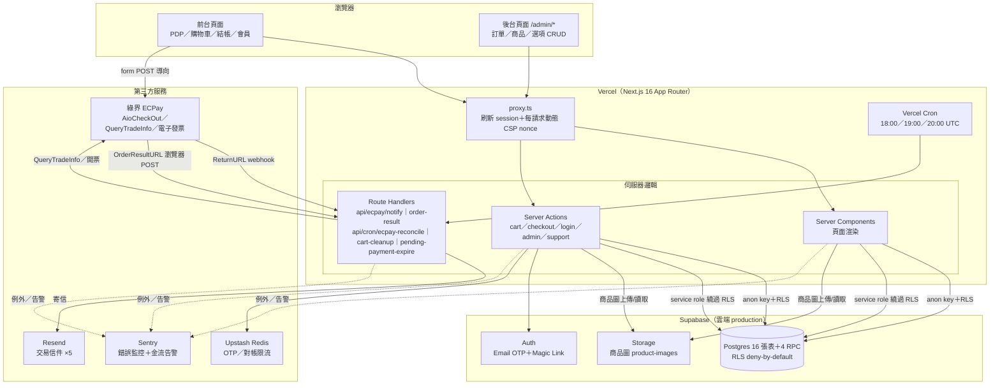
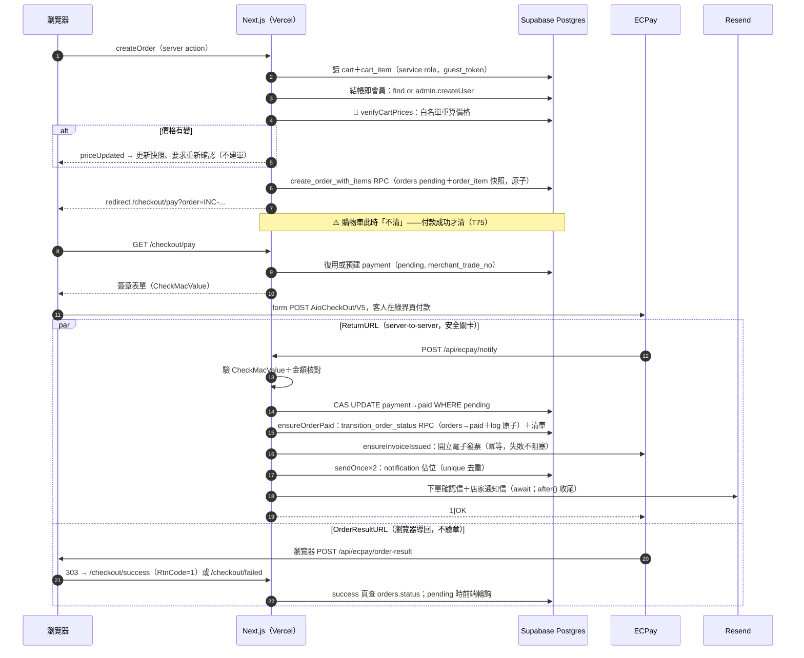
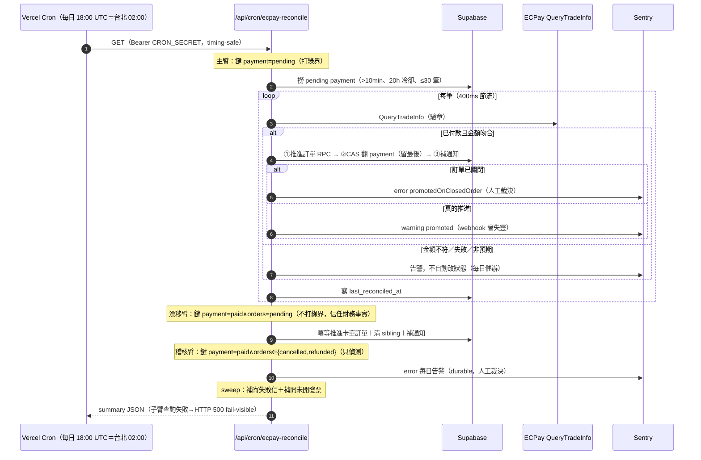
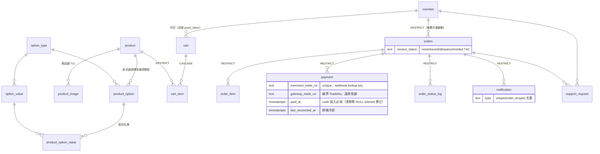
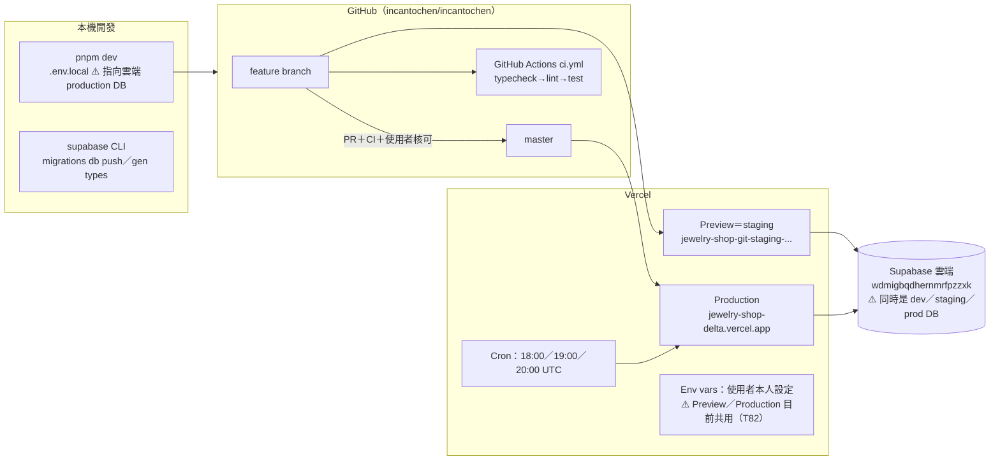

# architecture.md — 系統架構盤點

> 文件更新日期：2026-07-20（自 2026-07-07 初版全面刷新，對齊 M2 進行中現況）
> 用途：全專案系統架構總覽——模組職責、相依關係、資料流、第三方服務互動、部署架構、架構 Gap Analysis。
> 維護原則：架構有變（新模組／新第三方服務／流程改向）時更新對應章節與圖；Gap 條目落地成任務後移除、改在 `tasks.csv` 追蹤。
> 交叉參考：訂單狀態機與金流兜底對帳三臂的完整敘事見 [`system-flow-and-user-flow.md`](system-flow-and-user-flow.md)（附錄 A/B）與其視覺化版 `order-state-machine.html`；人工救援見 `ops-runbook.md`。

---

## 1. 系統架構總覽

單一 Next.js 16 App Router 應用部署於 Vercel，資料層為單一 Supabase 雲端專案（Postgres＋Auth＋Storage），金流／電子發票走綠界 ECPay，Email 走 Resend，OTP 與對帳限流走 Upstash Redis，監控走 Sentry。**沒有獨立後端服務**——所有伺服器邏輯都在 Next.js 的 Server Components／Server Actions／Route Handlers 內。



---

## 2. 模組盤點

### 2.1 模組總表

| 模組 | 位置 | 職責 | 主要相依 |
| ---- | ---- | ---- | -------- |
| 路由攔截＋CSP | `src/proxy.ts` | 每請求刷新 Supabase session；注入 `x-pathname`；**每請求動態產生 CSP（nonce＋strict-dynamic，T97/F-010）**——CSP 單一出處已從 next.config 搬來 | `@supabase/ssr`、env |
| 環境變數 | `src/lib/env.ts`（前端可見）、`env.server.ts`（server-only） | 前端：`NEXT_PUBLIC_SUPABASE_URL/ANON_KEY`；server：service role、ECPay 金鑰、Resend、Upstash、發票字軌、`ADMIN_EMAIL`、`CRON_SECRET`；皆 fail-fast，`import "server-only"` 防洩漏 | — |
| Supabase clients | `src/lib/supabase/` | 三種 client：`client.ts`（瀏覽器 anon）、`server.ts`（SSR anon＋cookie）、`service-role.ts`（繞過 RLS，server-only） | env |
| Auth | `src/app/login/`、`src/app/auth/confirm/`、`src/lib/auth/` | Email OTP（主）＋Magic Link（輔）；`requireUser()`／`requireAdmin()` 路由保護；`find-or-create-member`（member 無 INSERT policy，走 service role）；`normalize-email`、`safe-redirect` | Supabase Auth、rate-limit |
| 限流 | `src/lib/rate-limit.ts`、`redis.ts`、`get-client-ip.ts` | OTP 請求（email＋IP 雙桶）與驗證（IP）sliding window；對帳連續 403 計數；IP fallback（XFF 取最左） | Upstash Redis |
| 商品／配置器 | `src/app/products/[slug]/`、`src/app/collections/`、`src/components/product-configurator.tsx`、`src/lib/product/` | PDP＋資料驅動配置器（三層白名單）；品類目錄；`check-product-availability`（T117 暫停販售）；加入購物袋建 `guest_token` cookie | anon 讀（RLS 公開唯讀 `active`）、service role 寫 cart |
| 購物車 | `src/app/cart/`、`src/lib/cart/` | 讀取／改數量／刪除；擁有權檢查（cart.guest_token＝cookie）；徽章計數；**會員登入併車**（`merge-guest-cart`、`resolve-cart-identity`、`get-or-create-member-cart`，T81） | service role（cart RLS 全拒） |
| 報價／驗價 | `src/lib/quote/verify-prices.ts` | 🔴 安全紅線：Zod 驗 config_snapshot → DB 白名單重查 base_price＋option_value → 重建快照、回 `priceChanged` | service role |
| 結帳／建單 | `src/app/checkout/`、`src/lib/checkout/`、`src/lib/order/create-order-from-cart.ts` | 結帳即會員 → 驗價 → **`create_order_with_items` RPC 交易化建 orders＋order_item（T76）** → redirect `/checkout/pay`；付款成功才清車（T75） | verify-prices、Supabase admin API、RPC |
| 訂單狀態機 | `src/lib/order/` | `order-status.ts`（7 狀態＋合法轉換表＋PAID_LINEAGE）；`state-machine.ts`（transitionOrder／adminOverrideStatus＋取消/退款守衛）；`ensure-paid.ts`（冪等推進＋補通知＋清車）；`find-paid-payment`、`mark-pending-payments-failed`、`order-access-token`（T73）、`shipping-tracking` | service role、RPC |
| 退款 | `src/lib/order/refund-order.ts`、`api` 無（後台觸發） | T47 記錄式退款：`refund_order` RPC（payment refunded＋訂單 CAS＋稽核 log 原子）；誤走 Override 的補登記走 `repair_refunded_payment` RPC | service role、RPC、email |
| 電子發票 | `src/lib/order/issue-invoice.ts`、`invoice-meta.ts`、`src/lib/ecpay/invoice/` | T42：付款成功後開立 B2C 電子發票（冪等，issued 短路＋GetIssue 判別）；`issue.ts`／`invoice-client.ts`／`relate-number.ts`／`validate.ts`；**發票失敗不阻塞金流** | ECPay 發票 API、AES |
| ECPay 金流 | `src/lib/ecpay/`、`src/app/checkout/pay/`、`src/app/api/ecpay/` | 見 §2.2 | env.server、check-mac-value、aes-payload |
| 排程 Cron | `src/app/api/cron/*`、`src/lib/cron/require-cron-auth.ts` | 3 支：`ecpay-reconcile`（對帳三臂＋2 sweep）、`cart-cleanup`（清逾期訪客車）、`pending-payment-expire`（T66 逾期取消）；`CRON_SECRET` Bearer timing-safe 驗證 | query-trade-info、ensure-paid、state-machine、Sentry |
| Email | `src/lib/email/`、`src/lib/notification/senders.ts` | **5 種信**：下單確認、新訂單通知、出貨通知、**退款通知（T47）**、售後通知；共用 `escape-html`；`senders.ts` 註冊表（含 `eligibleStatuses` 適寄判斷） | Resend、service role |
| 通知去重 | `src/lib/notification/send-once.ts` | `notification(order_id, type)` unique 佔位 → 寄送 → 回填 sent/failed；failed／stale reclaim（條件式 UPDATE 防並發重寄）；保證不外拋 | service role |
| 後台 | `src/app/admin/*` | 訂單列表／詳情、狀態推進、出貨、Admin Override、**退款登記**、售後案件、PII 揭露＋稽核；**商品 CRUD（T10/T11）、選項 CRUD（T12/T13）**、代客建單；`action-result.ts` 統一回傳 | requireAdmin、state-machine、refund-order、storage |
| 售後 | `src/lib/support/`、`src/app/account/orders/[id]/support/` | 商品問題回報（`return_defect`）；後台手動建 `repair_maintenance`；service role 重驗擁有權 | support_request、email |
| 商品圖 Storage | `src/lib/storage/`、`src/app/admin/products/` | 商品圖上傳到 Supabase Storage（`product-images` bucket）；`product_image` 表 sort 完整性（0013） | Supabase Storage |
| PII | `src/lib/pii/` | `mask.ts` 遮罩顯示；`audit.ts` 存取稽核（**落 `pii_access_log` 表，T80** — 已從 stdout 改建表） | service role |
| 監控 | `src/instrumentation.ts`、`instrumentation-client.ts`、`global-error.tsx` | Sentry：server/edge/client 三端 init（僅 production）、`onRequestError`、金流關鍵路徑手動 capture | `@sentry/nextjs` |
| 安全 headers | `next.config.ts` | HSTS（僅 production）、X-Frame-Options／nosniff／Referrer-Policy／Permissions-Policy；**CSP 已移出**（改 proxy 動態 nonce），僅補靜態路徑最小 CSP（`script-src 'none'`） | — |
| DB schema | `supabase/migrations/0001`–`0021` | 16 張表＋4 RPC＋RLS＋索引；只增不改 | Supabase CLI |
| CI | `.github/workflows/ci.yml` | **PR／push master 跑 `pnpm typecheck → lint → test`（T101）**——lint/test 已在合併關卡上 | GitHub Actions |
| 測試 | `vitest` ＋ 各 `__tests__/`、`*.test.ts` | 驗價、CheckMacValue、AES、狀態機、退款、sendOnce、notify webhook、reconcile 三臂、createOrder、發票、support、PII、cart 併車 等 | vitest＋vite-tsconfig-paths |
| 開發護欄 | `.claude/hooks/` | protect-env／protect-migration／dangerous-bash／completion-check／auto-format／session-start | Claude Code hooks |

### 2.2 ECPay 子模組（金流核心）

| 檔案 | 職責 | 設計原因 |
| ---- | ---- | -------- |
| `check-mac-value.ts` | SHA256 CheckMacValue 產生＋timing-safe 驗證 | 對官方 8 組向量驗過（T24）；金流 SHA256／物流 MD5／發票 AES 不可混用 |
| `aes-payload.ts` | 電子發票 API 的 AES-128-CBC 加解密 | 發票 API 與金流簽章機制不同，獨立一支 |
| `merchant-trade-no.ts` | `generateMerchantTradeNo()`：order_no 去 hyphen 17 碼＋2 隨機＝19 碼 | ECPay 20 碼上限；每次付款嘗試新 trade no（T74） |
| `aio-payment.ts` | `buildAioParams()`：組 AioCheckOut/V5 表單參數（台灣時區、ItemName 截 200 字、快照名稱優先） | ReturnURL＝webhook（安全關卡）、OrderResultURL＝瀏覽器導回 |
| `query-trade-info.ts` | QueryTradeInfo/V5 查詢＋驗章；`RateLimitError`（限流/403）、`QueryTradeInfoHttpError`（5xx）分流拋出 | URL 由 `ECPAY_PAYMENT_URL` 推導、推導失敗 fail-fast |
| `validate-settle-amount.ts` | 結算金額三檢（non-finite／non-positive／mismatch）單一出處 | notify 與 reconcile 共用，杜絕散落複本失同步 |
| `invoice/` | 電子發票開立（`issue.ts`）、API client、字軌關聯號（`relate-number.ts`）、回應驗證 | T42；冪等、失敗不阻塞金流 |
| `checkout/pay/page.tsx` | SSR：查訂單→復用或預建 pending payment→簽章表單→client 自動送出 | 已 paid 直接導 success 防重付；用 client component 送出（App Router `dangerouslySetInnerHTML` script 不執行） |
| `api/ecpay/notify/route.ts` | ReturnURL webhook：驗章→金額核對→CAS 翻 payment→`ensureOrderPaid`（推進訂單/清車）→`ensureInvoiceIssued`→`ensureNotificationSent`→回 `1\|OK`；`after()` 收尾非關鍵工作 | 冪等；payment 不存在 fallback insert（23505 視為冪等）；外層 try/catch 防 500 引發無限重送 |
| `api/ecpay/order-result/route.ts` | OrderResultURL：瀏覽器 POST → 303 redirect success/failed | 刻意不驗章（僅前端導向）；303 強制 GET 否則 405 |
| `api/cron/ecpay-reconcile/route.ts` | **對帳三臂＋2 sweep**（見下） | T89＋T107＋T127；fail-visible（任一子臂查詢失敗回 HTTP 500） |

**對帳三臂**（`ecpay-reconcile`，每日台北 02:00，詳見 `system-flow-and-user-flow.md` 附錄 B）：
- **主臂**（鍵 `payment=pending`，打綠界）：QueryTradeInfo→金額吻合才「①推進訂單→②CAS 翻 payment 留最後→③補通知」，否則只告警不改狀態。
- **漂移臂**（鍵 `payment=paid ∧ orders=pending_payment`，不打綠界，T127）：救 webhook 側卡單，信任財務事實冪等推進＋清 sibling pending；無冷卻天然收斂。
- **稽核臂**（鍵 `payment=paid ∧ orders∈{cancelled,refunded}`，只偵測，durable）：錢收在已關閉訂單，每日告警到人工裁決。
- 另掛 **failed-notification sweep**（補寄失敗信）與 **uninvoiced sweep**（補開發票），皆冪等、限流 break 也照跑。

### 2.3 Supabase 三種 client 的使用規則（關鍵架構決策）

| Client | 金鑰 | RLS | 使用場景 |
| ------ | ---- | --- | -------- |
| `client.ts`（瀏覽器） | anon | 受限 | 目前僅 auth 流程；商品資料由 server 讀後傳 props |
| `server.ts`（SSR） | anon＋cookie | 受限 | 已登入者讀自己的 member／orders／order_item／payment／support_request（`select own`）；商品公開唯讀 |
| `service-role.ts` | service role | **繞過** | 一切寫入＋訪客 cart 讀取＋admin 全域讀取＋4 支 RPC 呼叫 |

設計原因：cart 對 anon 讀寫全拒、帳務表僅 `select own`，所有變更集中到 server-side，前端無從繞過驗價與擁有權檢查。代價是「擁有權檢查」從 DB policy 移到應用層（guest_token 比對、`order.member_id` 檢查），每個 service role action 都須自己做（CLAUDE.md §7 反向白名單審查重點）。

### 2.4 資料庫端交易化（4 支 RPC，關鍵演進）

多段寫入包進 plpgsql function＝同一交易單元，消滅「半套狀態」中間態：

| RPC | migration | 作用 |
| --- | --------- | ---- |
| `create_order_with_items` | 0010 | 建 orders＋order_item 原子化（T76，防孤兒訂單） |
| `transition_order_status` | 0017 | 訂單狀態 CAS UPDATE＋order_status_log INSERT 原子化（T110，防「狀態已變、log 缺漏」） |
| `refund_order` | 0020 | payment 翻 refunded＋訂單 CAS＋稽核 log 原子化（T47） |
| `repair_refunded_payment` | 0021 | 補登記退款（Override 逃生口留下的半套）：補翻 payment＋稽核 log 原子化（T47） |

> RPC 本身只是「呼叫 DB 函式」的機制；是「把多段寫入塞進同一函式」讓那次呼叫具原子性（見 `glossary.md`）。合法轉換白名單 `VALID_TRANSITIONS` 的單一權威在 TS 端（`order-status.ts`），RPC 刻意不驗合法性——非 override 的守衛由 `transitionOrder` 負責。

---

## 3. Runtime Request Flow

### 3.1 主流程：結帳 → 付款 → 入帳 → 通知 → 開票



### 3.2 兜底流程：每日對帳 Cron（三臂）



### 3.3 退款流程（T47 記錄式）

售後確認需退款 → 綠界廠商後台實際退刷 → `/admin/orders/[id]` 退款區塊登記 → `refund_order` RPC（payment refunded＋訂單 CAS→refunded＋稽核 log 原子）→ 退款通知信（sendOnce）。誤走 Admin Override 的半套（訂單 refunded／payment 仍 paid）由「補登記退款」（`repair_refunded_payment` RPC）補翻，並由 reconcile `paid-on-refunded` 稽核臂每日偵測。

### 3.4 登入流程（Email OTP 主、Magic Link 輔）

`/login` → `requestOtp`（Upstash email＋IP 雙桶限流）→ Supabase Auth 寄 OTP → `verifyOtpCode`（IP 限流；不假設碼長，雲端實際 8 位）→ `findOrCreateMember`（service role）→ session cookie。Magic Link 落地 `/auth/confirm`：**按鈕才消耗 token**。`proxy.ts` 每請求刷新 session＋產生 CSP nonce；`requireUser()` 保護 `/account/*`，`requireAdmin()`（比對 `ADMIN_EMAIL`）保護 `/admin/*`。

---

## 4. Database 關聯與資料流

### 4.1 ER 摘要（16 張表；完整版見 `docs/data-model.md`／`jewelry_mvp_ER.mermaid`）

分組：
- **商品與選項（6）**：product、product_image、option_type、option_value、product_option、product_option_value
- **會員與購物車（3）**：member、cart、cart_item
- **訂單與金流（3）**：orders、order_item、payment
- **通知與狀態（2）**：order_status_log、notification
- **售後（1）**：support_request
- **稽核（1）**：pii_access_log



外鍵策略：**帳務鏈 RESTRICT**（orders／order_item／payment／status_log／notification 禁連動刪）、**設定圖與暫態 CASCADE**（option 圖、cart、product_image）。`uq_payment_one_paid_per_order` 部分唯一索引保證一張訂單最多一筆 paid payment；`cart.guest_token`（0008）與 `cart.member_id`（0018）各有 unique 約束防併發重複。

### 4.2 資料寫入權責

| 表 | anon/authenticated 讀 | 寫入者 |
| -- | --------------------- | ------ |
| product／option 四表／product_image | 公開唯讀（限 `active`） | **後台 CRUD（T10–T13，已落地）** ＋ seed；service role |
| member | select own | service role（`findOrCreateMember`） |
| cart／cart_item | **全拒** | service role（products／cart actions＋併車，guest_token 擁有權檢查） |
| orders／order_item | select own | service role（`create_order_with_items` RPC、狀態機、admin、退款） |
| payment | select own | service role（pay page 預建、notify、reconcile 三臂、退款 RPC） |
| order_status_log | select own | service role（`transition_order_status`／`refund_order` RPC） |
| notification | select own | service role（send-once） |
| support_request | select own | service role（客人申請、admin 建案） |
| pii_access_log | 全拒 | service role（`logPiiAccess`，T80 落表） |

### 4.3 快照資料流（「訂單成立即契約」）

```
PDP 配置器（前端計價，僅顯示用）
  → addToCart：伺服器白名單重算 → cart_item.unit_price_snapshot + config_snapshot
  → createOrder：verifyCartPrices 再次以 DB 現值重算、重建 snapshot
      ├─ 價格有變 → 回寫 cart 快照＋要求確認（R/S/Q loop，不建單）
      └─ 無變 → create_order_with_items RPC 寫 order_item 快照＋product_name_snapshot
  → 付款成功（webhook/對帳）才清購物車（T75）
  → 之後商品改名／調價／下架一律不回寫已成立訂單；付款重試不重驗價
```

---

## 5. 第三方服務互動總覽

| 服務 | 用途 | 認證 | 呼叫點 | 失敗處理 |
| ---- | ---- | ---- | ------ | -------- |
| Supabase Postgres | 主資料庫＋4 RPC | anon／service role | 幾乎所有 server 邏輯 | `{data,error}` 每次解構檢查；金流路徑 error → throw |
| Supabase Auth | OTP／Magic Link／admin.createUser | anon＋service role | login、checkout（結帳即會員）、proxy | 回錯誤物件，映射使用者訊息 |
| Supabase Storage | 商品圖 | service role | admin 商品 CRUD | 上傳失敗回 action error |
| ECPay AioCheckOut | 付款頁 | MerchantID＋HashKey/IV（SHA256） | 瀏覽器 form POST | 失敗由 OrderResultURL 導 `/checkout/failed`，可重試（新 trade no） |
| ECPay ReturnURL | 入帳通知（inbound webhook） | CheckMacValue＋金額核對 | `/api/ecpay/notify` | 非 `1\|OK` ECPay 重送；handler 全冪等 |
| ECPay QueryTradeInfo | 主動對帳 | 同上簽章；TimeStamp 效期 | reconcile 主臂 | 限流→`RateLimitError` 中止；5xx→`QueryTradeInfoHttpError` 中止；驗章失敗告警 |
| ECPay 電子發票 | B2C 開票 | AES-128-CBC | notify＋reconcile sweep | 失敗不阻塞金流，只告警＋每日補開（T42） |
| Resend | 5 種交易信 | `RESEND_API_KEY` | send-once 包裝 | `{error}` 轉 throw → sendOnce 標 failed → 每日 sweep 補寄（T88） |
| Upstash Redis | OTP／對帳 403 限流 | REST URL＋TOKEN | login、reconcile | 命中回「請求太頻繁」；Redis 掛 fail-open |
| Sentry | 錯誤監控＋金流告警 | DSN（僅 production） | instrumentation 三端＋金流路徑 | — |
| Vercel Cron | 排程觸發 | `CRON_SECRET` Bearer（timing-safe） | `vercel.json` → 3 支 cron | 401 拒非法呼叫 |

**尚未串接**（技術棧已鎖定但未動工）：綠界黑貓宅配物流（T48，目前 `shipping_fee=0` 佔位）、綠界退刷 API 自動化（T47 為記錄式，實際退刷仍走綠界後台）、Resend 自有網域＋SPF/DKIM（T35/T50，FROM 仍 `onboarding@resend.dev`）、電子發票正式帳號＋字軌（T122，目前 sandbox）。

---

## 6. 部署架構



- **CI/CD**：**GitHub Actions `ci.yml`（T101）在 PR／push master 上跑 `pnpm typecheck → lint → test`**，是合併關卡（分支保護 required check `check`）。Vercel build 另擋 preview 部署（type error）；`.claude/hooks` 本機護欄；PR 流程（本機 `/code-review high` → 使用者觸發 ultra）。
- **環境變數**：多個變數，本機 `.env.local`／Vercel Dashboard 各一份，使用者本人維護（Claude 不經手）；`env.ts`／`env.server.ts` fail-fast。
- **DB migration**：Supabase CLI 手動 `db push`（先於 merge/部署）；無自動化 migration pipeline。

---

## 7. 文件對照表（架構視角）

| 架構面向 | 對應文件 |
| -------- | -------- |
| 開發規則／目前狀態 | `CLAUDE.md`（主入口）、`memory.md`、`docs/work-log.md` |
| 系統/使用者流程 | `docs/user-flow.md`、`docs/system-flow-and-user-flow.md`（四層＋狀態機＋對帳三臂）、`order-state-machine.html` |
| 資料模型 | `docs/data-model.md`、`jewelry_mvp_ER.mermaid`、`src/types/database.types.ts` |
| Migration 流程 | `docs/migration-guide.md`、`docs/migration-runbook.md` |
| 產品範圍 | `docs/PRD.md`、`docs/IA.md`、`docs/brand-guide.md`、`docs/launch-scope.md` |
| 工程品質 | `docs/coding-system.md`（寫碼前必讀）、`docs/review-findings.md`、`docs/test-plan.md` |
| 營運救援 | `docs/ops-runbook.md`、`docs/security-foundation.md` |
| 任務／決策 | `docs/tasks.csv`、`docs/decisions.csv` |
| 名詞對照 | `docs/glossary.md`／`glossary.html` |
| ECPay 知識庫 | `.claude/skills/ecpay`（官方）、`docs/ecpay-blueprint/`、`docs/ecpg-migration-plan.md`（站內付 2.0） |

---

## 8. 架構 Gap Analysis

自 2026-07-07 初版以來，絕大多數缺口已落地。本節記錄「仍開放的架構級風險」與「已關閉缺口的存根」。

### 8.1 仍開放的架構級風險

| 風險 | 現況 | 追蹤 |
| ---- | ---- | ---- |
| 🔴 **環境不分離**：本機 dev、staging preview、production 全打同一顆 Supabase production DB；Vercel env Preview/Production 共用 | 誤操作／staging 測試會直接汙染正式資料——**唯一真正的架構級風險**，在寫入面持續擴大前應優先解 | **T82**（P0）、T83 |
| 🔴 **DB 備份未設定** | 上線紅線（CLAUDE.md §6） | **T34**（P0） |
| 🟠 **Email 送達性**：FROM 仍 `onboarding@resend.dev`、無 SPF/DKIM/DMARC | 上線前必換自有網域 | **T35**、T50 |
| 🟠 **黑貓宅配未串接**：`shipping_fee=0` 佔位 | 運費與物流單號現況人工 | **T48** |
| 🟠 **電子發票仍 sandbox**：正式帳號＋字軌未設定 | 上線前切正式 | **T122** |
| 🟡 **自動化測試套件（E2E）未落地**：CI 目前只有 typecheck/lint/unit test，無 `verify:all`＋Playwright E2E | 金流閉環回歸靠人工 | **T106** |
| 🟡 **後台仍單一 email 權限**：`requireAdmin`＝`ADMIN_EMAIL` 比對，非角色系統 | MVP 可接受，多人營運前再議 | T09 註記（MVP 做法） |

### 8.2 已關閉缺口（存根，詳見 tasks.csv）

初版 §8.1／§8.2 的多數條目已落地：訂單建立交易化（**T76**）、狀態機 read-then-update race（**T92**）＋狀態＋log 交易化（**T110**）、建單即清車改付款成功才清（**T75**）、pending_payment 逾期取消（**T66/T74**）、sendOnce 失敗信自動重試（**T88**）、成功頁存取控制＋order_no 高熵（**T73**）、cart.guest_token unique（**T70/T08**）、訪客車併會員（**T81**）、cart/support 限流＋過期清理（**T78**）、PII 稽核落表（**T80**）、後台 CRUD（**T10–T13**）、CSP 動態 nonce（**T97**）、最小 CI（**T101**，關閉初版 G-03）、MerchantTradeNo parse 單一出處（**T96**，G-01）、死檔清除（**T100**，G-02）、reconcile 容量假設明碼化（**T102**，G-04/G-05）。webhook 側卡單自癒（**T127**）與記錄式退款（**T47**）為初版後新增並已落地。

### 8.3 架構健康度評估（正面確認）

- **無過度耦合**：模組邊界清楚——ECPay 邏輯收在 `src/lib/ecpay/`＋route、金額單一出處（`verify-prices.ts`／`validate-settle-amount.ts`）、狀態轉換單一出處（`state-machine.ts`＋4 RPC）、通知去重單一出處（`send-once.ts`）、識別碼互轉單一出處（`merchant-trade-no.ts`）。
- **交易化到位**：四段關鍵多寫入（建單、狀態轉換、退款、補登記）皆下沉為 DB RPC，消滅半套狀態中間態。
- **金流兜底縱深**：Webhook（即時）→ 成功頁主動查詢（即時）→ 對帳三臂＋2 sweep（每日）→ email-pending（最後安全網），每層守衛條件明確、靜默失敗點皆接 Sentry。
- **兩條安全紅線落實可驗證**：驗價（T41）在 `createOrder` 為必經路徑無旁路；金流冪等由 unique 約束＋條件式 UPDATE 保證，並有單元測試覆蓋。

### 8.4 改善建議優先序

1. **T82 環境分離**（P0，唯一真正的架構級風險）——寫入面已隨後台 CRUD 擴大，越晚做風險越高。
2. **T34 DB 備份**（P0，上線紅線）。
3. **T35／T50 Email 網域＋T122 發票正式帳號＋T48 物流**——上線必要子集（見 `launch-scope.md`）。
4. **T106 E2E 測試套件**——把金流閉環回歸從人工升級為 CI 保護。
