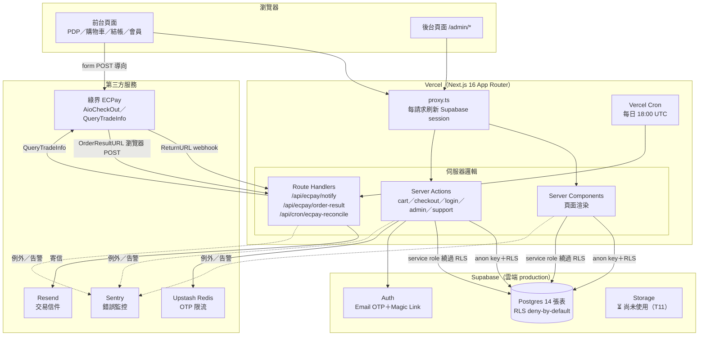
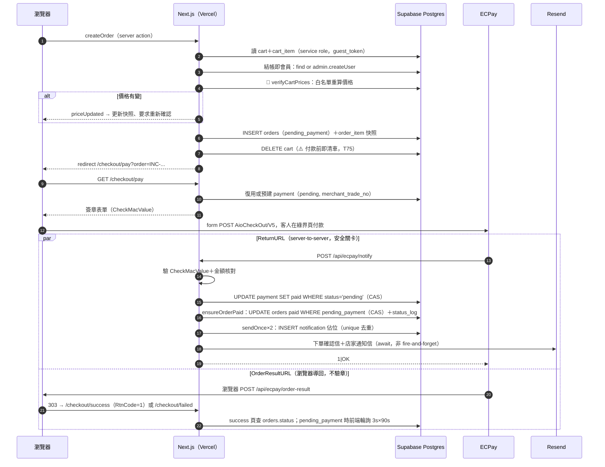
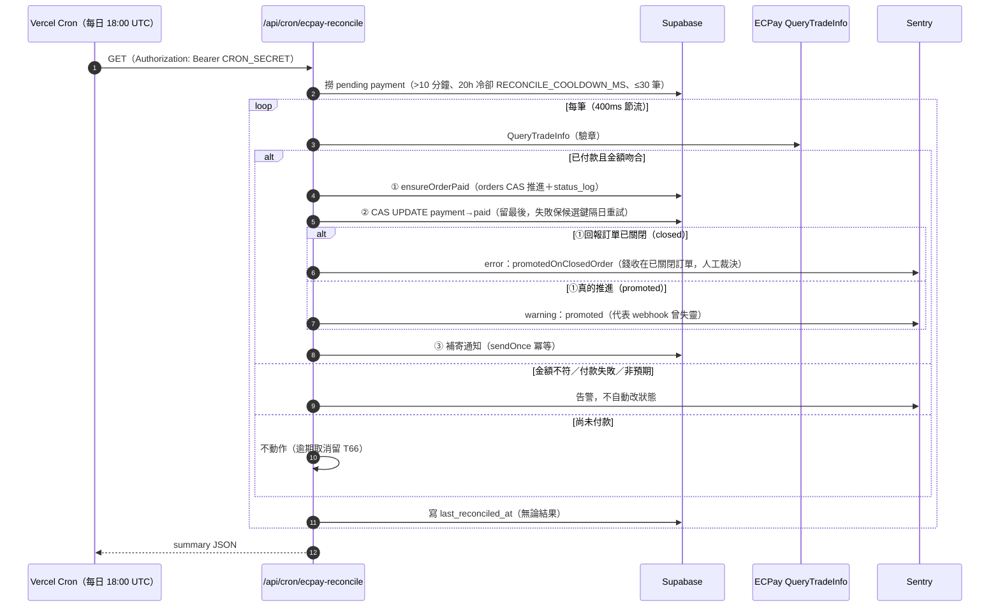
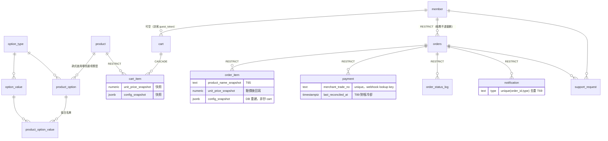
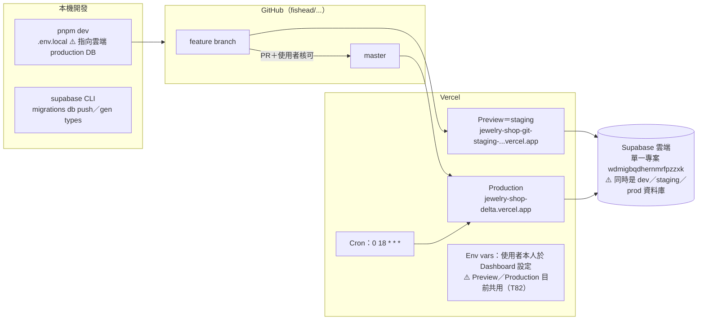

# architecture.md — 系統架構盤點

> 文件更新日期：2026-07-07
> 用途：全專案系統架構總覽——模組職責、相依關係、資料流、第三方服務互動、部署架構、架構 Gap Analysis。
> 產出方式：2026-07-07 對全部 170 個 tracked 檔案的靜態盤點（僅分析，未改程式碼）。
> 維護原則：架構有變（新模組／新第三方服務／流程改向）時更新對應章節與圖；Gap 條目落地成任務後移除、改在 `tasks.csv` 追蹤。

---

## 1. 系統架構總覽

單一 Next.js 16 App Router 應用部署於 Vercel，資料層為單一 Supabase 雲端專案（Postgres＋Auth），金流走綠界 ECPay，Email 走 Resend，OTP 限流走 Upstash Redis，監控走 Sentry。**沒有獨立後端服務**——所有伺服器邏輯都在 Next.js 的 Server Components／Server Actions／Route Handlers 內。



---

## 2. 模組盤點

### 2.1 模組總表

| 模組                    | 位置                                                                      | 職責                                                                                                                                                                            | 主要相依                                                        |
| ----------------------- | ------------------------------------------------------------------------- | ------------------------------------------------------------------------------------------------------------------------------------------------------------------------------- | --------------------------------------------------------------- |
| 路由攔截                | `src/proxy.ts`                                                            | 每請求刷新 Supabase session cookie；注入 `x-pathname` header                                                                                                                    | `@supabase/ssr`、`env.ts`                                       |
| 環境變數（前端可見）    | `src/lib/env.ts`                                                          | `NEXT_PUBLIC_SUPABASE_URL/ANON_KEY`，fail-fast                                                                                                                                  | —                                                               |
| 環境變數（server-only） | `src/lib/env.server.ts`                                                   | service role key、ECPay 金鑰、Resend、Upstash、`ADMIN_EMAIL`、`CRON_SECRET`；`import "server-only"` 防洩漏                                                                      | —                                                               |
| Supabase clients        | `src/lib/supabase/`                                                       | 三種 client：`client.ts`（瀏覽器 anon）、`server.ts`（SSR anon＋cookie）、`service-role.ts`（繞過 RLS，server-only）                                                            | env 模組                                                        |
| Auth                    | `src/app/login/`、`src/app/auth/confirm/`、`src/lib/auth/`                | Email OTP（主）＋Magic Link（輔）；`requireUser()`／`requireAdmin()` 路由保護；`findOrCreateMember` 建會員 row（member 表無 INSERT policy，走 service role）                    | Supabase Auth、rate-limit                                       |
| 限流                    | `src/lib/rate-limit.ts`                                                   | OTP 請求（email 5/15m＋IP 10/10m）與驗證（IP 30/1m）sliding window                                                                                                              | Upstash Redis                                                   |
| 商品／配置器            | `src/app/products/[slug]/`、`src/components/product-configurator.tsx`     | PDP＋資料驅動配置器（三層白名單）；加入購物袋 server action 建 `guest_token` cookie                                                                                             | anon 讀（RLS 公開唯讀 `status='active'`）、service role 寫 cart |
| 購物車                  | `src/app/cart/`、`src/lib/cart/`                                          | 讀取／改數量／刪除；擁有權檢查（cart_item 所屬 cart.guest_token 必須等於 cookie）；徽章計數                                                                                     | service role（cart 表 RLS 全拒）                                |
| 報價／驗價              | `src/lib/quote/verify-prices.ts`                                          | 🔴 安全紅線：Zod 驗 config_snapshot → DB 白名單重查 base_price＋option_value → 重建快照、回傳 `priceChanged`                                                                    | service role                                                    |
| 結帳／建單              | `src/app/checkout/actions.ts`、`src/lib/checkout/schema.ts`               | 結帳即會員（admin API 背景建帳號）→ 驗價 → 寫 orders＋order_item 快照 → 清車 → redirect `/checkout/pay`                                                                         | verify-prices、Supabase admin API                               |
| 訂單狀態機              | `src/lib/order/`                                                          | `order-status.ts`（純常數：7 狀態＋合法轉換表）；`state-machine.ts`（transitionOrder／adminOverrideStatus＋order_status_log 稽核）；`ensure-paid.ts`（冪等推進 paid＋補寄通知） | service role                                                    |
| ECPay 金流              | `src/lib/ecpay/`、`src/app/checkout/pay/`、`src/app/api/ecpay/`           | 見 §2.2                                                                                                                                                                         | env.server、check-mac-value                                     |
| 對帳 Cron               | `src/app/api/cron/ecpay-reconcile/route.ts`                               | T89 每日主動對帳：pending payment → QueryTradeInfo → CAS 推進或告警；`CRON_SECRET` Bearer 驗證                                                                                  | query-trade-info、ensure-paid、Sentry                           |
| Email                   | `src/lib/email/`                                                          | 4 種信：下單確認（客人）、新訂單通知（店家）、出貨通知（客人）、售後通知（店家）；共用 `escape-html.ts`                                                                         | Resend、service role（查信件資料）                              |
| 通知去重                | `src/lib/notification/send-once.ts`                                       | `notification(order_id, type)` unique 佔位 → 寄送 → 回填 sent/failed；failed／stale-pending reclaim（條件式 UPDATE 防並發重寄）；保證不外拋例外                                 | service role                                                    |
| 後台                    | `src/app/admin/orders/`                                                   | 訂單列表／詳情、狀態推進、出貨（tracking_no＋通知信）、Admin Override、售後案件管理、PII 揭露（`revealOrderPii`＋稽核 log）                                                     | requireAdmin、state-machine、sendOnce                           |
| 售後                    | `src/lib/support/`、`src/app/account/orders/[id]/support/`                | 商品問題回報（`return_defect`）；後台手動建 `repair_maintenance`；寫入一律 service role                                                                                         | support_request 表、email                                       |
| PII                     | `src/lib/pii/`                                                            | `mask.ts` 遮罩顯示；`audit.ts` 存取稽核（結構化 JSON → Vercel function logs，T64 定案不建表）                                                                                   | —                                                               |
| 監控                    | `src/instrumentation.ts`、`instrumentation-client.ts`、`global-error.tsx` | Sentry：server/edge/client 三端 init（僅 production enabled）、`onRequestError`、金流關鍵路徑手動 capture                                                                       | `@sentry/nextjs`                                                |
| 安全 headers            | `next.config.ts`                                                          | CSP（form-action 白名單 ECPay）、HSTS（僅 production）、X-Frame-Options 等；`withSentryConfig` 包裹                                                                             | —                                                               |
| DB schema               | `supabase/migrations/0001`–`0007`                                         | 14 張表＋RLS＋索引；只增不改                                                                                                                                                    | Supabase CLI                                                    |
| 測試                    | `vitest` ＋ 各 `__tests__/`、`*.test.ts`                                  | 單元測試：驗價、CheckMacValue、狀態機、sendOnce、notify webhook、reconcile、createOrder、support schema、PII mask                                                               | vitest＋vite-tsconfig-paths                                     |
| 開發護欄                | `.claude/hooks/`                                                          | protect-env／protect-migration／dangerous-bash／completion-check／auto-format／session-start                                                                                    | Claude Code hooks                                               |

### 2.2 ECPay 子模組（金流核心，值得單獨拆開）

| 檔案                                | 職責                                                                                                                                                                                                  | 設計原因                                                                                                                                                                                               |
| ----------------------------------- | ----------------------------------------------------------------------------------------------------------------------------------------------------------------------------------------------------- | ------------------------------------------------------------------------------------------------------------------------------------------------------------------------------------------------------ | ------------------------------------------------------------------------------------------------------- |
| `check-mac-value.ts`                | SHA256 CheckMacValue 產生＋timing-safe 驗證                                                                                                                                                           | 對官方 8 組測試向量驗證通過（T24）；金流 SHA256／物流 MD5 金鑰不可混用                                                                                                                                 |
| `merchant-trade-no.ts`              | `generateMerchantTradeNo()`：order_no 去 hyphen 17 碼＋2 隨機字元＝19 碼                                                                                                                              | ECPay 20 碼上限；每次付款嘗試新 trade no，避免重複拒絕（T53）                                                                                                                                          |
| `aio-payment.ts`                    | `buildAioParams()`：組 AioCheckOut/V5 表單參數（台灣時區、ItemName 截 200 字、快照名稱優先）                                                                                                          | ReturnURL＝webhook（安全關卡）、OrderResultURL＝瀏覽器導回                                                                                                                                             |
| `query-trade-info.ts`               | QueryTradeInfo/V5 查詢＋驗章；非 200 拋 `RateLimitError`（呼叫端中止整批）                                                                                                                            | URL 由 `ECPAY_PAYMENT_URL` 推導、推導失敗 fail-fast，不新增 env var                                                                                                                                    |
| `checkout/pay/page.tsx`             | SSR：查訂單→復用或預建 pending payment→產生簽章表單→client 自動送出                                                                                                                                   | 已 paid 直接導 success 防重付；App Router 內 `dangerouslySetInnerHTML` script 不執行，故用 client component `ecpay-auto-submit.tsx`                                                                    |
| `api/ecpay/notify/route.ts`         | ReturnURL webhook：驗章→金額核對→條件式 UPDATE（只從 pending 推進）→`ensureOrderPaid`＋`ensureNotificationSent`→永遠回 `1                                                                             | OK` HTTP 200                                                                                                                                                                                           | 冪等、payment 不存在時 fallback insert（23505 視為冪等成功）、外層 try/catch 防 500 引發 ECPay 無限重送 |
| `api/ecpay/order-result/route.ts`   | OrderResultURL：瀏覽器 POST → 303 redirect success/failed                                                                                                                                             | 刻意不驗章（僅前端導向，非安全關卡）；303 強制 GET 否則 405                                                                                                                                            |
| `api/cron/ecpay-reconcile/route.ts` | 每日兜底：撈 pending 超過 10 分鐘且 20 小時（`RECONCILE_COOLDOWN_MS`）內未對過帳的 payment（上限 30 筆、400ms 節流）→查 ECPay→金額吻合才「①推進訂單→②CAS 翻 payment（留最後）→③補寄通知」，否則只告警 | 「webhook＋主動對帳共用冪等鎖」紅線落地（T89）；promoted 一律 Sentry 告警供追蹤 webhook 可靠度（T88/T90）；訂單已關閉仍收到錢走 `promotedOnClosedOrder` 獨立訊號（error，人工裁決見 ops-runbook §6.1） |

### 2.3 Supabase 三種 client 的使用規則（關鍵架構決策）

| Client                | 金鑰         | RLS      | 使用場景                                                                                                               |
| --------------------- | ------------ | -------- | ---------------------------------------------------------------------------------------------------------------------- |
| `client.ts`（瀏覽器） | anon         | 受限     | 目前僅 auth 流程；商品資料由 server 端讀取後傳 props                                                                   |
| `server.ts`（SSR）    | anon＋cookie | 受限     | 已登入者讀自己的 member／orders／order_item／payment／support_request（`select own` policy）；商品公開唯讀             |
| `service-role.ts`     | service role | **繞過** | 一切寫入（cart／orders／payment／notification／support_request 全無 anon 寫入 policy）＋訪客 cart 讀取＋admin 全域讀取 |

設計原因：cart 對 anon **讀寫全拒**、帳務表僅 `select own`，所有變更集中到 server-side 程式碼，前端無從繞過驗價與擁有權檢查。代價是「擁有權檢查」從 DB policy 移到應用層（guest_token 比對、`order.member_id !== user.id` 檢查），每個 service role action 都必須自己做——這已列入審查重點（CLAUDE.md §7 反向白名單）。

---

## 3. Runtime Request Flow

### 3.1 主流程：結帳 → 付款 → 入帳 → 通知



### 3.2 兜底流程：每日對帳 Cron



### 3.3 登入流程（Email OTP 主、Magic Link 輔）

`/login` → `requestOtp`（Upstash 雙重限流：email＋IP）→ Supabase Auth 寄 OTP → `verifyOtpCode`（IP 限流；不假設碼長，雲端實際 8 位）→ `findOrCreateMember`（service role，member 表無 INSERT policy）→ session cookie。Magic Link 落地 `/auth/confirm`：**按鈕才消耗 token**（防 email 掃描器預取誤耗）。`proxy.ts` 每請求刷新 session；`requireUser()` 保護 `/account/*`，`requireAdmin()`（email 比對 `ADMIN_EMAIL`）保護 `/admin/*`。

---

## 4. Database 關聯與資料流

### 4.1 ER 摘要（14 張表；完整版見 `docs/jewelry_mvp_ER.mermaid`／`docs/data-model.md`）



外鍵策略：**帳務鏈 RESTRICT**（orders／order_item／payment／status_log／notification 禁連動刪）、**設定圖與暫態 CASCADE**（option 圖、cart）。`uq_payment_one_paid_per_order` 部分唯一索引保證一張訂單最多一筆 paid payment。

### 4.2 資料寫入權責（誰能寫什麼）

| 表                   | anon/authenticated 讀            | 寫入者                                                         |
| -------------------- | -------------------------------- | -------------------------------------------------------------- |
| product／option 四表 | 公開唯讀（限 `status='active'`） | 目前僅 seed／SQL（後台 CRUD 為 T10–T13）                       |
| member               | select own                       | service role（`findOrCreateMember`）                           |
| cart／cart_item      | **全拒**                         | service role（products／cart actions，guest_token 擁有權檢查） |
| orders／order_item   | select own                       | service role（`createOrder`、狀態機、admin actions）           |
| payment              | select own                       | service role（pay page 預建、notify webhook、reconcile cron）  |
| order_status_log     | select own                       | service role（state-machine／ensure-paid）                     |
| notification         | select own                       | service role（send-once）                                      |
| support_request      | select own                       | service role（客人申請 action、admin 建案）                    |

### 4.3 快照資料流（「訂單成立即契約」）

```
PDP 配置器（前端計價，僅顯示用）
  → addToCart：伺服器白名單重算 → cart_item.unit_price_snapshot + config_snapshot
  → createOrder：verifyCartPrices 再次以 DB 現值重算、重建 snapshot
      ├─ 價格有變 → 回寫 cart 快照＋要求使用者確認（R/S/Q loop）
      └─ 無變 → order_item 寫入驗價後快照＋product_name_snapshot
  → 之後商品改名／調價／下架一律不回寫已成立訂單；付款重試不重驗價（T65 定案）
```

---

## 5. 第三方服務互動總覽

| 服務                 | 用途                              | 認證                                  | 呼叫點                                       | 失敗處理                                                                  |
| -------------------- | --------------------------------- | ------------------------------------- | -------------------------------------------- | ------------------------------------------------------------------------- | ----------------------------------- |
| Supabase Postgres    | 主資料庫                          | anon key／service role key            | 幾乎所有 server 邏輯                         | `{data,error}` 每次解構檢查（coding-system 通則）；金流路徑 error → throw |
| Supabase Auth        | OTP／Magic Link／admin.createUser | anon＋service role                    | login actions、checkout（結帳即會員）、proxy | 回傳錯誤物件，映射為使用者訊息                                            |
| ECPay AioCheckOut    | 付款頁                            | MerchantID＋HashKey/IV（SHA256 簽章） | 瀏覽器 form POST（非 server 呼叫）           | 失敗由 OrderResultURL 導 `/checkout/failed`，可重試（新 trade no）        |
| ECPay ReturnURL      | 入帳通知（inbound webhook）       | CheckMacValue 驗章＋金額核對          | `/api/ecpay/notify`                          | 非 `1                                                                     | OK` 時 ECPay 會重送；handler 全冪等 |
| ECPay QueryTradeInfo | 主動對帳                          | 同上簽章；TimeStamp 3 分鐘效期        | reconcile cron                               | 非 200＝限流→中止整批；驗章失敗→throw 告警                                |
| Resend               | 4 種交易信                        | `RESEND_API_KEY`                      | send-once 包裝下的 email 模組                | `{error}` 轉 throw → sendOnce 標 failed（重試待 T88）                     |
| Upstash Redis        | OTP 限流                          | REST URL＋TOKEN                       | login actions                                | 限流命中回「請求太頻繁」；IP 取不到時跳過 IP 桶（防共用 bucket 誤鎖）     |
| Sentry               | 錯誤監控＋金流告警                | DSN（僅 production enabled）          | instrumentation 三端＋金流路徑手動 capture   | —                                                                         |
| Vercel Cron          | 排程觸發                          | `CRON_SECRET` Bearer                  | `vercel.json` → reconcile                    | 401 拒非法呼叫                                                            |

**尚未串接**（技術棧已鎖定但未動工）：Supabase Storage（T11 商品圖）、綠界黑貓宅配物流（T48）、ECPay 電子發票（T42）、ECPay 退刷 API（T47）、Resend 自有網域（T35/T50）。

---

## 6. 部署架構



- **CI/CD**：無獨立 CI（無 `.github/workflows`）。品質關卡＝Vercel build（含 tsc）＋本機 `pnpm lint`／`pnpm test`＋PR 流程（本機 `/code-review high` → 使用者觸發 `/code-review ultra`）＋`.claude/hooks` 護欄。lint/test **不在合併路徑上強制執行**。
- **環境變數**：13＋個變數，本機 `.env.local`／Vercel Dashboard 各一份，由使用者本人維護（Claude 不經手）。`env.ts`／`env.server.ts` fail-fast。
- **DB migration**：Supabase CLI 手動 `db push`（先於 merge/部署，見 T65 教訓）；無自動化 migration pipeline。

---

## 7. 文件對照表（架構視角）

| 架構面向           | 對應文件                                                                             |
| ------------------ | ------------------------------------------------------------------------------------ |
| 開發規則／目前狀態 | `CLAUDE.md`（主入口）、`memory.md`、`docs/work-log.md`                               |
| 資料模型           | `docs/data-model.md`、`docs/jewelry_mvp_ER.mermaid`、`src/types/database.types.ts`   |
| Migration 流程     | `docs/migration-guide.md`、`docs/migration-runbook.md`                               |
| 使用者動線         | `docs/user-flow.md`、`docs/wireframe/*`                                              |
| 產品範圍           | `docs/PRD.md`、`docs/IA.md`、`docs/brand-guide.md`                                   |
| 工程品質           | `docs/coding-system.md`（寫碼前必讀）、`docs/review-findings.md`                     |
| 任務／決策         | `docs/tasks.csv`、`docs/decisions.csv`、`docs/sprint_overview.csv`                   |
| ECPay 知識庫       | `.claude/skills/ecpay`（官方）、`docs/ecpay-blueprint/`（⚠️ untracked，見 Gap G-09） |
| **本文件**         | `docs/architecture.md` ＝系統架構總覽（⚠️ 尚未列入 `docs/docs-index.md`）            |

**文件缺口**：無 ops runbook（T90 已排）、無環境變數清冊（散落 CLAUDE.md 各段與 env 模組）、`docs-index.md` 未收錄 `coding-system.md` 之後新增的文件時序。

---

## 8. 架構 Gap Analysis

大部分已知風險**已被任務系統追蹤**（T66–T92），這是健康訊號——以下把「架構層」的觀察整理成一張圖景，區分「已追蹤」與「本次盤點新發現」。

### 8.1 已追蹤的高風險缺口（僅列架構級，依風險排序）

| 風險                                                                                                                            | 現況                                   | 追蹤               |
| ------------------------------------------------------------------------------------------------------------------------------- | -------------------------------------- | ------------------ |
| 🔴 環境不分離：本機 dev、staging preview、production 全打同一顆 Supabase production DB；Vercel env vars Preview/Production 共用 | 誤操作／staging 測試會直接汙染正式資料 | **T82**（P0）、T83 |
| 🔴 DB 備份未設定                                                                                                                | 上線紅線（CLAUDE.md §6）               | **T34**（P0）      |
| 🟠 訂單建立非交易化：orders 成功、order_item 失敗留孤兒訂單                                                                     | 靠人工清理；建議 Postgres RPC 包交易   | T76                |
| 🟠 建單即清車：付款失敗客人須重新配置半客製商品                                                                                 | 高流失風險                             | T75                |
| 🟠 pending_payment 無時效：客人可壓舊價很久後再付款                                                                             | 逾期自動取消                           | T66、T74           |
| 🟠 狀態機 read-then-update race：`transitionOrder` 先 SELECT 再 UPDATE，無條件式守衛（對照 `ensureOrderPaid` 已用 CAS）         | 並發下可能非法轉換各自成功             | T92（F-007）       |
| 🟠 sendOnce failed 信件無自動重試迴路（只靠下一次 webhook 重送觸發 reclaim）                                                    | 通知可能永久漏寄                       | T88                |
| 🟠 Email FROM 仍為 `onboarding@resend.dev`，無 SPF/DKIM                                                                         | 上線前必換                             | T35、T50           |
| 🟡 成功頁僅憑 order_no 可見 email／姓名／金額；order_no 用 `Math.random`                                                        | 資訊洩漏面                             | T73                |
| 🟡 cart.guest_token 無 unique 約束（check-then-insert 併發重複）                                                                |                                        | T70                |
| 🟡 後台無獨立權限模型：`requireAdmin`＝單一 email 字串比對                                                                      | 後台擴充（T10–T13）前應先落地          | T09                |
| 🟡 訪客購物車與會員永不合併（cart.member_id 從未被寫入）                                                                        | 登入後車消失的體驗缺口                 | T81                |
| 🟡 限流僅覆蓋 OTP；cart 寫入／createOrder／support 申請無限流                                                                   | service role 寫入放大濫用影響          | T78                |

### 8.2 本次盤點新發現（未見於 tasks.csv）

| #    | 發現                                              | 說明                                                                                                                                                                                                                                                                                        | 建議                                                                                                                          |
| ---- | ------------------------------------------------- | ------------------------------------------------------------------------------------------------------------------------------------------------------------------------------------------------------------------------------------------------------------------------------------------- | ----------------------------------------------------------------------------------------------------------------------------- |
| G-01 | **MerchantTradeNo→order_no 解析仍有兩份手刻複本** | T67 修正了 slice 數值，但 `notify/route.ts:54` 與 `order-result/route.ts:14` 各自手刻同一段 slice 重組；`merchant-trade-no.ts` 只有 generate、沒有 parse。這正是 CLAUDE.md §6「識別碼互轉單一出處」規則點名的形態——下次改 order_no 格式必再失同步                                           | 在 `merchant-trade-no.ts` 加 `parseOrderNoFromMerchantTradeNo()` 供兩處 import（小改，可併入任一金流任務）                    |
| G-02 | **`types/supabase.ts` 是死檔**                    | 179 行舊生成型別，零引用；實際用的是 `src/types/database.types.ts`（813 行）。兩份並存遲早有人 import 錯                                                                                                                                                                                    | 刪除 `types/supabase.ts`                                                                                                      |
| G-03 | **lint／test 不在合併關卡上**                     | 無 GitHub Actions；Vercel build 只擋 type error，vitest 測試套件（含金流冪等測試）靠人工執行                                                                                                                                                                                                | 加最小 CI：PR 上跑 `pnpm lint && pnpm test`（一次性設定，防護金流回歸）                                                       |
| G-04 | **Cron 與 serverless timeout 的容量邊界未驗證**   | reconcile 最壞情況 30 筆×(400ms 節流＋ECPay RTT)≈ 30–60 秒；目前安全，但 `vercel.json` 未設 `maxDuration`，依賴平台預設。積壓超過 30 筆時只能等隔日批次                                                                                                                                     | 在 route 註記容量假設；若 pending 積壓成常態再調 CANDIDATE_LIMIT／頻率                                                        |
| G-05 | **店家 email 三處定義、兩處寫死**                 | `env.server.ts` 的 `ADMIN_EMAIL`（供 `requireAdmin` 權限比對）之外，`new-order-notification.ts:9` 與 `support-request-notification.ts:13` 各自寫死 `OWNER_EMAIL = "fishead02290@gmail.com"` 常數。換信箱要改三處；且「後台權限身分」與「營運通知收件人」是兩種角色，目前混用同一個 email 值 | 短期：兩個 `OWNER_EMAIL` 常數改讀 env var（CLAUDE.md T49 段落原本就註明「T35 後改 env var」）；T09 做權限模型時再拆開兩種角色 |
| G-06 | **PII 稽核 log 依賴 Vercel logs 留存期**          | `logPiiAccess` 寫 stdout，Vercel function logs 免費層留存極短，實質上稽核不可回溯（T80 已提「強化」但未含留存期事實）                                                                                                                                                                       | 確認 Vercel 方案的 log 留存；不足則接 log drain 或落表                                                                        |
| G-07 | **配置器前端計價與伺服器驗價是兩份公式**          | `product-configurator.tsx` 前端即時計價、`verify-prices.ts` 伺服器重算——安全上正確（前端僅顯示），但公式若改（如加折扣）兩處要同步改，目前無共用純函式                                                                                                                                      | 抽出共用純計價函式（client 可 import），伺服器仍以 DB 白名單取值——顯示與驗價共用邏輯、不共用資料來源                          |
| G-08 | **guest_token cookie 無效期策略文件化不足**       | cart 無 TTL、token 無輪替；T78 提過期清理但購物車生命週期（cookie maxAge vs DB row）沒有定案文件                                                                                                                                                                                            | 在 data-model.md 補 cart 生命週期定案，與 T78 一起做                                                                          |
| G-09 | **`docs/ecpay-blueprint/` 目錄 untracked**        | git status 顯示整個目錄未 commit（含 architecture／flows／testing 子目錄與 SESSION-HANDOFF.md），跨 session 有遺失風險                                                                                                                                                                      | 確認內容後 commit 或明確捨棄                                                                                                  |

> **落地狀態（2026-07-08）**：G-01→**T96**（排程審查 F-009 同日獨立發現，交叉印證）、G-02→**T100**（F-013 同上）、G-03→**T101**、G-04＋G-05→**T102**、G-06→`decisions.csv` **#13**（拍板後即為 T80 實作內容）、G-07→刻意不排程（觸發時機＝計價邏輯變更，屆時併入該任務）、G-08→`decisions.csv` **#14**＋併入 T78 說明、G-09→已解決（ecpay-blueprint 已登錄 docs-index；衍生 ECPG 取代規劃見 `ecpg-migration-plan.md`＝**T103**）。

### 8.3 架構健康度評估（正面確認）

- **無過度耦合**：模組邊界清楚——ECPay 邏輯全收在 `src/lib/ecpay/`＋三個 route、金額計算單一出處（`verify-prices.ts`）、狀態轉換單一出處（`state-machine.ts`／`ensure-paid.ts`）、通知去重單一出處（`send-once.ts`）。
- **無重複設計**（除 G-01／G-02／G-07 三個小型例外）：四封 email 模組刻意鏡射同一架構，屬可接受的平行結構而非壞重複。
- **資料流清楚**：快照鏈（§4.3）與金流冪等鏈（pay 預建→webhook CAS→cron 兜底 CAS）都有單一方向、明確的守衛條件，且關鍵決策都有註解記載原因。
- **兩條安全紅線落實可驗證**：驗價（T41）在 `createOrder` 為必經路徑、無旁路；金流冪等由 unique 約束＋條件式 UPDATE 保證，並有單元測試覆蓋。

### 8.4 改善建議優先序

1. **T82 環境分離**（P0，唯一真正的架構級風險）——在後台 CRUD（T10–T13）開工、寫入面擴大之前完成。
2. **G-03 最小 CI**——半天內可完成，保護所有後續開發。
3. **G-01 parse 函式單一出處＋G-02 刪死檔**——各 15 分鐘，順手併入下一個金流／清理 PR。
4. **T92／T88／T76／T75**——依既有任務優先級走 dev-next 流程，不需重排。
5. **G-05／G-07**——不獨立開工，分別掛在 T09、未來計價邏輯變更時一併處理。
6. **G-09**——確認 `docs/ecpay-blueprint/` 去留（一句話決策）。
