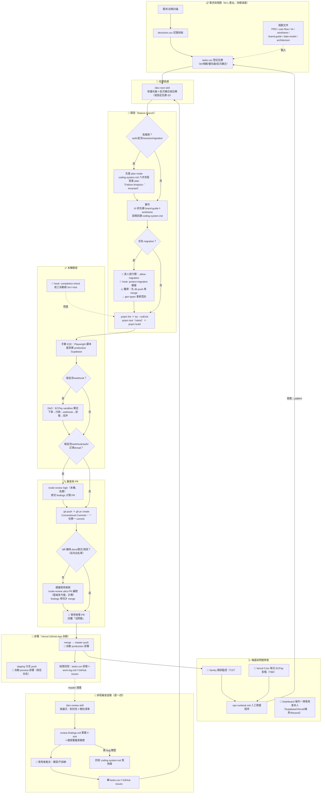

# dev-process.md — 開發流程全貌（v1）

> 文件更新日期：2026-07-08
> 用途：盤點**目前實際運作中**的開發流程（非理想藍圖）——需求→規劃→開發→審查→測試→PR→部署→上線→維運→問題修復，標示各階段對應的文件、工具、自動化與前置條件。
> 依據：`CLAUDE.md` §7、`docs/coding-system.md`、`.claude/`（hooks／skills）、`vercel.json`、實際 PR 歷史（#4–#33）。
> 相關文件：系統架構視角見 `docs/architecture.md`；本檔是**流程視角**，兩者互補。

---

## 1. 全流程圖（Mermaid）

**三種真人必停節點（刻意設計，非流程缺陷）**：①migration 放行閘＋db push 綠燈 ②PR「沒問題」才 merge ③review findings 只有使用者能改「確認/不採納」。加上「env 變數／Dashboard 一律使用者本人操作」，構成單人開發下的四道人工防線。

---

## 2. 流程 × 文件 × 工具對照表

| 階段 | 主要文件（輸入→輸出） | 工具／自動化 | 前置條件・相依 |
|------|----------------------|--------------|----------------|
| 需求分析 | 輸入：PRD、user-flow、競品分析 → 輸出：decisions.csv | 人工討論（App Chat＋Claude Code） | — |
| 規劃 | 輸入：decisions → 輸出：tasks.csv 任務列（含依賴/批次） | /dev-review（審查衍生任務）、plan mode | 決策已拍板 |
| 文件撰寫 | docs-index.md 為目錄；風格依 `incantochen-docs.skill` | — | 新文件須回登 docs-index |
| 任務挑選 | 輸入：tasks.csv → 輸出：本次任務＋計畫 | **/dev-next skill** | 依賴任務已完成；批次耦合同批做 |
| 開發 | 輸入：coding-system.md（必讀）、brand-guide＋wireframe（UI）、data-model（schema）→ 輸出：feature branch | plan mode（高風險必進）；**hooks**：protect-env／protect-migration／dangerous-bash／auto-format／session-start | 高風險先 plan mode；migration 需真人放行 |
| Migration | migration-guide（規則）＋migration-runbook（操作） | Supabase CLI（db push／gen types）；protect-migration hook | **先 db push 再 merge**；已套用不可改 |
| 測試 | 輸出：`*.test.ts`（vitest，102+ 測試） | `pnpm test`；**completion-check hook**（收工自動 lint+test）；Playwright（手動腳本 E2E）；ECPay sandbox | 金流改動 DoD＝sandbox 實走 |
| Code Review | 輸入：diff → 輸出：findings 修復 | **/code-review high**（本機，開 PR 前）；**/code-review ultra**（雲端，使用者觸發、計費） | 反向白名單：非純 docs/樣式/測試一律建議 ultra |
| Git／PR | CLAUDE.md §7（規範） | gh CLI；Conventional Commits；feature branch＋PR | 使用者「沒問題」才 merge |
| 部署 | — | **Vercel GitHub App**：master→production、其他分支→preview（staging 固定別名） | env vars 使用者本人設定 |
| 上線準備 | T38 checklist（tasks.csv 內）；T82/T83/T34/T50 dashboard 項 | securityheaders.com 掃描（人工） | M5；全部 dashboard 項由使用者執行 |
| 維運 | **ops-runbook.md**（人工救援） | **Sentry**（T37）；**Vercel Cron** `/api/cron/ecpay-reconcile`（每日 18:00 UTC）；Vercel logs | Cron 僅 production 生效 |
| 問題修復 | coding-system.md §3.5 三問（root cause 協定）→ 回寫案例庫 | /code-review；grep 擴散檢查 | 修 bug 先答三問；同 pattern 同批修 |
| 排程審查 | 輸出：review-findings.md（F-###＋覆蓋表） | **/dev-review skill**（週一/四排程） | 只有使用者能確認 findings→轉任務 |
| 結案 | tasks.csv 回寫＋work-log.md＋issues close | /dev-next 結案段 | merge 完成 |

---

## 3. 自動化流程清單（現況全量）

| # | 自動化 | 觸發 | 作用 |
|---|--------|------|------|
| 1 | hook `protect-env` | 讀寫 `.env*` | 硬擋（金鑰紅線） |
| 2 | hook `protect-migration` | schema 變更 | 硬擋，需真人建 `.claude/.allow-migration` |
| 3 | hook `dangerous-bash` | `rm -rf`／`git push --force`／`DROP TABLE`／`db reset` 等 | 硬擋 |
| 4 | hook `auto-format` | 寫檔後 | prettier/eslint（非阻斷） |
| 5 | hook `completion-check` | session 收工（Stop） | 自動跑 `pnpm lint`＋`pnpm test` |
| 6 | hook `session-start` | session 開始 | 注入紅線提醒 |
| 7 | Vercel GitHub App | git push | master→production、分支→preview 自動部署（build 含 tsc） |
| 8 | Vercel Cron | 每日 18:00 UTC | `/api/cron/ecpay-reconcile` 金流主動對帳（T89） |
| 9 | Sentry | runtime 例外 | 錯誤監控＋告警（T37；webhook/寄信/對帳靜默失敗點已接） |
| 10 | skill `/dev-next`／`/dev-review`／`/code-review` | 人工或排程觸發 | 任務挑選／排程審查／diff 審查（半自動） |

**明確不存在**：GitHub Actions（無 `.github/`）、repo scripts、Dependabot alerts（T91 列管）、自動化 E2E 套件、PR 狀態檢查（merge 無任何機器關卡）。

---

## 4. 流程 Gap Analysis

### 4.1 缺漏／自動化不足（建議處理，依優先序）

| # | 缺口 | 影響 | 建議 | 優先 |
|---|------|------|------|------|
| P-01 | **lint／test 不在 merge 關卡上**（無 CI；Vercel build 只擋 type error；vitest 只在本機＋hook 跑） | 金流冪等測試（T85 特地補的回歸網）可以被完全繞過 merge；`--no-verify` 或跳過 hook 即無防線 | 加最小 GitHub Actions：PR 上跑 `pnpm lint && pnpm test`，設為 required check（＝architecture.md G-03，半天工作量） | **P1** |
| P-02 | **結案回寫非強制**：T89 已 merge（PR #33）但 tasks.csv 仍「未開始」；work-log 斷檔 5 天（07-03～07-07 未記，本次已回填） | 跨 session 接手看到錯誤狀態；「文件與流程不一致」的直接實例 | /dev-next 結案段已含回寫清單——問題在**跳過 dev-next 直接做任務時**沒有等效關卡；建議：merge 後的結案回寫納入 completion-check 提醒，或養成「merge 即回寫」與 PR 合併同一動作 | **P1** |
| P-03 | **依賴漏洞無自動通報**（CLAUDE.md 說「安全漏洞才升級」但沒有機制會通知有漏洞；F-003 postcss 即靠審查偶然發現） | 已知 CVE 無人知曉 | 開 GitHub Dependabot alerts（T91 已列管，僅設定檔工作） | P1（已列管） |
| P-04 | **E2E 驗證無沉澱**：每次任務手寫 Playwright 腳本、用完即棄；踩坑（`form.requestSubmit()` 等）靠 work-log 文字傳承 | 重複勞動；驗證品質依 session 而異 | ✅ 已升級為 **T106 自動化測試階段**（2026-07-08）：測試計畫＝`docs/test-plan.md`（S1–S7 案例矩陣＋`verify:all`＋自動測試紀錄），取代原「掛任務順手做」方案 | P1（T106） |
| P-05 | **migration「先 push 再 merge」順序靠人記**：hook 只擋修改，不驗證順序 | 順序顛倒→部署窗口期 schema 不一致 | 低成本：PR 模板/檢核清單加一條；已有 coding-system §4.5 條目，維持紀律即可 | P2 |
| P-06 | **部署後無自動驗證**（無 smoke test、securityheaders 掃描為人工、上線檢查集中在 T38 一次性） | production 壞掉靠 Sentry 事後知 | MVP 可接受；T38 落地時把「部署後檢查」寫成可重複 checklist 收進 ops-runbook | P3 |

### 4.2 重複／不一致（本次文件整理已處理者標 ✅）

- ✅ memory.md 與 CLAUDE.md／tasks.csv 大面積重複且過時（狀態停在 06-25）→ 已改為 durable decisions 定位，進度歸 tasks.csv。
- ✅ data-model.md／migration-guide.md 殘留「尚未建表／尚未裝 CLI」等已完成事項 → 已轉歷史紀錄或更新。
- ✅ user-flow.md「6 位數 OTP」與實際（雲端 8 碼、彈性驗證）不符；「待付款不自動取消」與 T66 決策不符 → 已修。
- ✅ sprint_overview.csv 任務數/人天過時 → 已在 docs-index 標記為歷史基準。
- ⚠️ **CLAUDE.md 頂部狀態區持續膨脹**（217 行，超過自訂 200 行目標；每完成一任務加一段 ✅，與 tasks.csv/work-log 三處重複）——建議下次整理：✅ 段落只留「durable 架構規則」（service role 模式、OTP 長度陷阱等），任務史細節指向 tasks.csv。**本次未動**（CLAUDE.md 是 Claude Code 主上下文，壓縮屬行為變更，留使用者裁決）。
- ⚠️ `docs/ecpay-blueprint/`（19 檔）與 `docs/architecture.md` 尚未 commit（architecture.md G-09）；ecpay-blueprint 內的 `SESSION-HANDOFF.md` 任務已完成，可精簡為一行歷程或移除。

### 4.3 手動作業盤點（多數屬刻意設計）

| 手動作業 | 屬性 |
|----------|------|
| env 變數／Dashboard 設定（Supabase/Vercel/綠界/Resend） | 🔒 刻意（金鑰紅線），保留 |
| migration 放行＋db push 綠燈 | 🔒 刻意（真人閘），保留 |
| PR「沒問題」才 merge；ultra review 由使用者觸發 | 🔒 刻意（單人品管），保留 |
| review findings 確認/不採納 | 🔒 刻意，保留 |
| 每任務手寫 Playwright E2E | ⚙️ 可優化（P-04） |
| 結案回寫 tasks.csv／work-log | ⚙️ 可優化（P-02） |
| merge 前跑測試 | ⚙️ 應自動化（P-01） |

---

## 5. 改善建議總結（依優先序）

1. **P-01 最小 CI**（GitHub Actions：PR 跑 lint＋test）——唯一「機器該擋而沒擋」的關卡，建議登記為新任務（M2，0.5 人天）。
2. **P-02 結案紀律**——流程已有（/dev-next 結案段），問題是繞過時無兜底；先把 T89 結案回寫補上。
3. **P-03 Dependabot**——T91 既有列管，可提前做（純設定）。
4. **P-04 E2E 腳本沉澱**——下次寫 E2E 時順手收進 `tests/e2e/`，不必獨立開工。
5. **CLAUDE.md 瘦身**——下次文件整理時與使用者確認壓縮方式。
