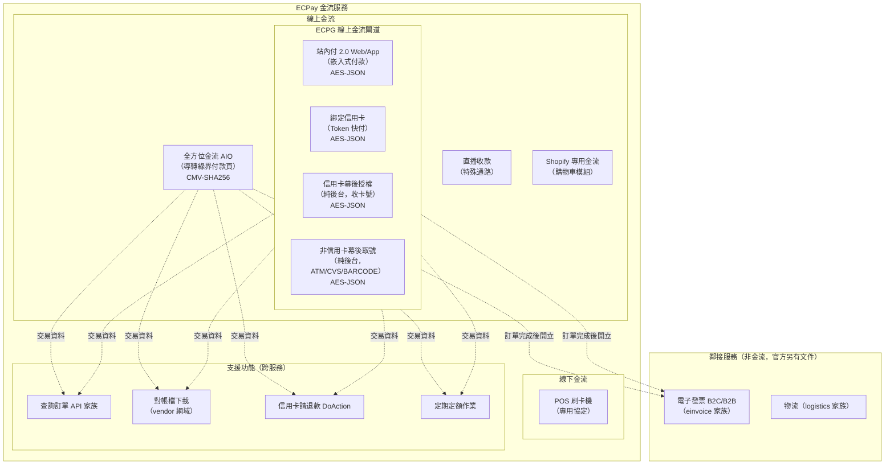
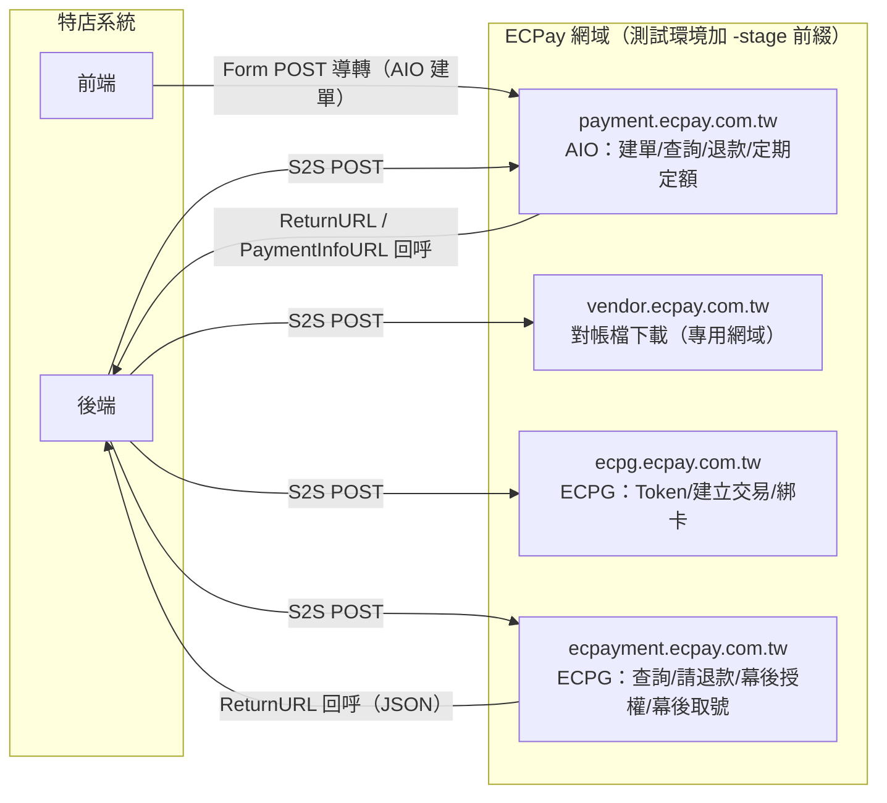
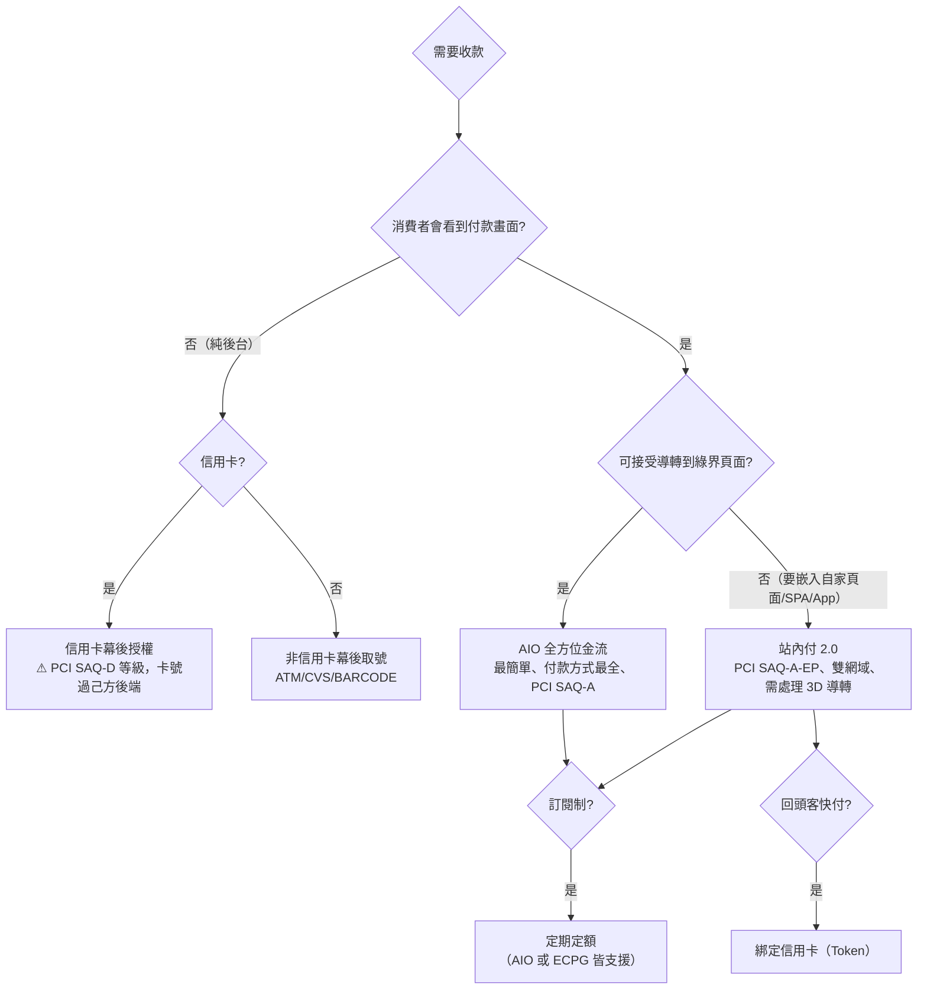

# 01. ECPay 金流服務全景

> 目的：在寫任何一行程式之前，先建立「ECPay 有哪些金流服務、彼此關係、走哪種協議、打哪個網域」的完整地圖。

## 1. 服務家族總覽

**關鍵定位**：

- **AIO**：消費者導轉到綠界付款頁完成付款。最簡單、PCI 合規負擔最低（SAQ-A）、付款方式最齊全。官方明示：若要在商場網頁內完成付款，應改用站內付。
- **ECPG（EC Payment Gateway）**：綠界線上金流閘道服務的總稱，涵蓋站內付 2.0、綁定信用卡、幕後授權、幕後取號等多項服務。注意：**ECPG ≠ 站內付 2.0**，站內付只是其中一項。
- **支援功能**：查詢、對帳、退款、定期定額作業並非獨立服務，而是依附在 AIO 與 ECPG 各自的 API 家族中，端點與協議不同但語意對應。

## 2. 兩種合約模式（商務面，API 技術規格相同）

| 比較項目 | 代收付模式（大特店） | 新型閘道模式 |
|---------|--------------------|-------------|
| 簽約對象 | 僅與綠界簽約 | 分別與各銀行＋綠界簽約 |
| 款項撥付 | 綠界代收後依約定撥款 | 合約銀行直接撥付，綠界不經手款項 |
| 付款方式差異 | 支援 TWQR/BNPL/微信/Apple Pay 等 | 額外支援美國運通（AMEX）、國旅卡 |
| 可用金流服務 | AIO、站內付 2.0、綁卡、幕後授權、幕後取號、Shopify、直播（7 種） | AIO、站內付 2.0、綁卡、幕後授權（4 種） |
| API 串接差異 | **無** — 兩種模式 API 端點、參數、加密方式完全相同 | 同左 |

> 架構含義：合約模式是後台設定問題，**不需要在系統架構中為它建立分支**。設計時以「付款方式可用性」作為設定資料，而非寫死。

## 3. 協議模式（決定模組的底層設計）

ECPay 金流 API 依「簽章／加密方式」分為兩大協議模式，這是模組劃分的第一依據（見 `03-architecture/01-module-design.md`）：

| 協議模式 | 適用服務 | Content-Type | 認證方式 | 回應格式 |
|---------|---------|-------------|---------|---------|
| **CMV-SHA256** | AIO 全部 API、AIO 對帳檔下載 | `application/x-www-form-urlencoded` | CheckMacValue（SHA256） | HTML（建單導轉）、URL-encoded 字串、JSON（部分查詢）、CSV（對帳檔）——**同一協議內回應格式不統一** |
| **AES-JSON** | 站內付 2.0、綁卡、幕後授權、幕後取號 | `application/json` | Data 欄位 AES-128-CBC 加密＋Timestamp 時效驗證 | 三層 JSON（外層 TransCode／內層加密 Data 含 RtnCode） |

兩協議的 URL Encode 規則**不同且不可混用**（CMV 需 urlencode→轉小寫→.NET 字元還原；AES 僅 urlencode）。詳見 `03-architecture/04-security.md`。

## 4. 環境與網域拓撲

| 網域 | 測試 | 正式 | 用途 |
|------|------|------|------|
| AIO 金流 | `payment-stage.ecpay.com.tw` | `payment.ecpay.com.tw` | 建單、查詢、DoAction、定期定額作業、撥款對帳檔 |
| 對帳檔 | `vendor-stage.ecpay.com.tw` | `vendor.ecpay.com.tw` | 特店對帳媒體檔（**與 AIO 主網域不同，常見踩坑**） |
| ECPG Token | `ecpg-stage.ecpay.com.tw` | `ecpg.ecpay.com.tw` | GetTokenbyTrade、CreatePayment、綁卡系列 |
| ECPG 交易 | `ecpayment-stage.ecpay.com.tw` | `ecpayment.ecpay.com.tw` | QueryTrade、DoAction、幕後授權、幕後取號 |

> ⚠️ 站內付 2.0 **雙網域**是最常見的 404 根因與上線漏洞：Token/建立交易走 `ecpg`，查詢/請退款走 `ecpayment`，混用會 404；上線時兩個網域都要去掉 `-stage`。

## 5. 付款方式 × 服務支援矩陣（代收付模式）

| 付款方式＼服務 | AIO | 站內付 2.0 | 綁定信用卡 | 幕後授權 | 幕後取號 |
|---------------|:---:|:---------:|:---------:|:-------:|:-------:|
| 信用卡一次付清 | ● | ● | ● | ● | |
| 信用卡紅利折抵 | ● | ● | | ● | |
| 信用卡分期付款 | ● | ● | ● | ● | |
| 信用卡定期定額 | ● | ● | | ● | |
| 銀聯卡 | ● | ● | | ● | |
| Apple Pay | ● | ● | | | |
| TWQR | ● | | | | |
| 微信支付 | ● | | | | |
| BNPL 無卡分期（最低 3,000 元） | ● | | | | |
| ATM 虛擬帳號 | ● | ● | | | ● |
| 超商代碼 | ● | ● | | | ● |
| 超商條碼 | ● | ● | | | ● |
| WebATM（手機版不支援） | ● | | | | |
| 綠界 PAY | ● | | | | |

> 新型閘道模式額外支援 AMEX 與國旅卡（AIO／站內付／綁卡／幕後授權），不支援 TWQR/微信/BNPL。

## 6. 選型決策樹

**PCI DSS 範圍影響**（選型的安全成本）：

| 整合方式 | PCI 等級 | 說明 |
|---------|---------|------|
| AIO（導轉） | SAQ-A | 卡號完全不經過特店系統 |
| 站內付 2.0 | SAQ-A-EP | 前端嵌入付款元件，卡號直送綠界、不經特店後端 |
| 幕後授權 | SAQ-D 或更高 | 特店後端直接處理卡號，需完整 PCI DSS 合規 |

## 7. 全域硬性約束（所有服務通用）

1. 僅支援新台幣（TWD），金額一律正整數、不可有小數。
2. 僅支援 TLS 1.2 以上。
3. 3D Secure 2.0 已強制實施（2025/8 起）。
4. `MerchantTradeNo` 上限 20 字元、僅英數字、全店唯一不可重複。
5. `MerchantTradeDate` 必須為 UTC+8（`yyyy/MM/dd HH:mm:ss`）；主機須做時間校正。
6. HashKey/HashIV 不得出現在前端或版本控制。
7. 回呼 URL 僅支援 port 80/443、不可在 CDN 後方、不支援中文網址（需 punycode）。
8. 參數值禁止 HTML 標籤；`ItemName`/`TradeDesc` 含系統指令關鍵字會被 WAF 攔截。
9. API 呼叫過快回 HTTP 403，需等約 30 分鐘恢復（速率門檻：**官方未說明**）。
10. 防火牆設定應使用 FQDN 而非固定 IP。
