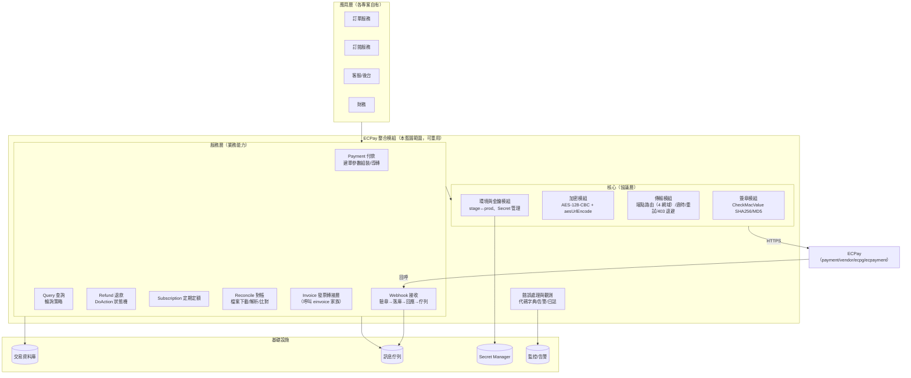
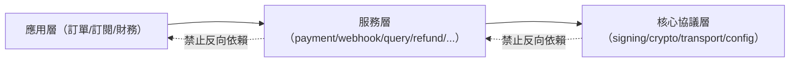

# 03-1. 系統架構與模組劃分

> 目標：一套可搬到任何電商專案的 ECPay 整合模組設計。與語言、框架無關；只定義邊界、責任與依賴方向。

## 1. 設計原則

1. **協議層與業務層分離**：CheckMacValue／AES 加解密／HTTP 細節屬「協議層」，訂單狀態與退款決策屬「業務層」。協議層絕不含業務判斷，業務層絕不直接碰 HashKey。
2. **金額與狀態的唯一真相在伺服器端資料庫**：前端傳來的金額永不採信；綠界回呼與查詢結果一律驗章後才落庫。
3. **每個外部通知都是「事件」**：回呼先原文落庫（event store）再處理，處理必冪等。
4. **三道核對防線**：即時回呼（主線）→ 主動查詢（補救）→ 每日對帳（最終防線）。
5. **設定資料化**：付款方式可用性、環境 URL、金鑰一律外部設定，不寫死。

## 2. 模組全景



## 3. 模組責任表

| 模組 | 責任 | 明確不做 |
|------|------|---------|
| **簽章模組** | CheckMacValue 產生與驗證（SHA256；驗證必用 timing-safe 比較）；`ecpayUrlEncode`（urlencode→小寫→.NET 字元還原） | 不做 AES；不判斷業務狀態 |
| **加密模組** | AES-128-CBC 加解密、`aesUrlEncode`（僅 urlencode）、Base64 標準 alphabet、Timestamp 時效 | 不與簽章模組共用 URL encode 實作（兩者規則不同，**混用是最高頻錯誤**） |
| **傳輸模組** | 4 網域路由表（payment/vendor/ecpg/ecpayment）、Content-Type 對應、回應格式解析（HTML/URL-encoded/JSON/CSV）、逾時（一般 30s、對帳 60s）、403 退避 | 不重試建單類請求（避免重複交易） |
| **環境與金鑰模組** | stage/prod URL 切換單一開關；HashKey/HashIV 自 Secret Manager 載入；金鑰輪換 SOP 支援 | 金鑰不進版本控制、不進前端、不進日誌 |
| **Payment** | 建單參數組裝與驗證（長度/字元白名單/金額正整數/UTC+8 時間）、MerchantTradeNo 產生（唯一、≤20 英數）、付款方式設定 | 不信任前端金額；不在前端計算 CheckMacValue |
| **Webhook 接收** | 驗章→事件原文落庫→冪等更新→10 秒內回 `1\|OK`→耗時工作推佇列 | 不在回呼 handler 內做出貨/發信/開發票等重邏輯 |
| **Query** | 各查詢 API 的輪詢策略（付款方式別）、TimeStamp 3 分鐘時效管理 | 不對 ATM/CVS/BARCODE/BNPL 主動輪詢（官方明示） |
| **Refund** | 帳務狀態查詢→依狀態機選擇 C/R/E/N→結果落庫 | 不對非信用卡交易呼叫 DoAction |
| **Subscription** | 定期定額合約管理、PeriodReturnURL 事件處理、ReAuth/Cancel | 不提供「暫停/恢復」（官方無此 API） |
| **Reconcile** | 每日下載對帳媒體檔＋撥款對帳檔、CSV 解析、與本地訂單比對、差異分類與告警 | 不自動修改帳務資料（差異一律人工裁決） |
| **Invoice 轉接層** | 訂單完成事件 → 呼叫電子發票 API 家族（獨立於金流失敗，發票失敗不影響金流） | 不阻塞付款主流程 |
| **錯誤處理與觀測** | RtnCode/TradeStatus 代碼字典、雙層檢查（TransCode→RtnCode）、監控指標與告警門檻 | — |

## 4. 建議目錄結構（語言無關的邏輯結構）

```
ecpay/
├── core/
│   ├── signing/          # CheckMacValue（SHA256/MD5）＋ ecpayUrlEncode ＋ timing-safe 驗證
│   ├── crypto/           # AES-128-CBC ＋ aesUrlEncode ＋ Timestamp
│   ├── transport/        # 網域路由、Content-Type、回應解析、逾時、403 退避
│   └── config/           # 環境切換、金鑰載入、付款方式設定
├── payment/
│   ├── aio/              # 建單參數組裝（各付款方式子模組）
│   └── ecpg/             # Token／CreatePayment／綁卡（雙網域路由在 transport 統一管）
├── webhook/
│   ├── endpoints/        # return-url / payment-info / period-return / order-result（每回呼一端點）
│   ├── verify/           # 驗章調度（依來源選 CMV 或 AES）
│   └── handlers/         # 冪等處理器（佇列消費端）
├── query/                # 各查詢 API ＋ 輪詢排程
├── refund/               # DoAction 狀態機
├── subscription/         # 定期定額
├── reconcile/            # 下載、解析、比對、差異報告
├── invoice/              # 發票轉接層（einvoice 家族 client）
└── shared/
    ├── codes/            # RtnCode/TradeStatus/付款方式對照表（送出值≠回傳值）
    └── errors/           # 錯誤分類與例外定義
```

**劃分理由**：

- `core/signing` 與 `core/crypto` **刻意分開**：兩者 URL encode 規則不同，放在一起最容易互相汙染（官方明確警告不可混用）。
- `webhook/endpoints` 每回呼一端點：AIO 的 ReturnURL/PaymentInfoURL/OrderResultURL 用途、格式、回應皆不同，共用端點是官方點名的常見錯誤。
- `shared/codes` 獨立：送出的 `ChoosePayment=Credit` 與回傳的 `PaymentType=Credit_CreditCard` 不同、ATM 取號成功碼=2、CVS/BARCODE=10100073 等「代碼語意」集中一處，避免散落各處失同步。
- `reconcile` 與 `query` 分開：一個是批次檔案處理（T+1），一個是即時 API（秒級），部署與排程需求不同。

## 5. 依賴方向規則



- 核心協議層不得 import 服務層；服務層不得 import 應用層。
- 應用層透過**事件**接收金流結果（付款成功/失敗/退款完成），不直接讀綠界回呼原文。
- 綠界特有識別碼（TradeNo、MerchantTradeNo、Gwsr 等）的格式轉換只允許單一出處實作。

## 6. 部署形態考量

| 環境 | 注意事項 |
|------|---------|
| 傳統常駐伺服器 | 回呼 handler 可用行程內佇列，但仍建議外部佇列以利水平擴充 |
| Serverless／FaaS | **禁止 fire-and-forget**：回應送出後執行環境可能被凍結，耗時工作必須 await 或交給平台的 waitUntil／外部佇列 |
| 多節點（Load Balancer） | 同一回呼可能重送到不同節點：冪等必須靠資料庫層（條件式 UPDATE／unique constraint），不可靠記憶體鎖 |
| 容器化 | 主機時間校正（NTP）必備——MerchantTradeDate 需 UTC+8，QueryTradeInfo TimeStamp 僅 3 分鐘有效 |
