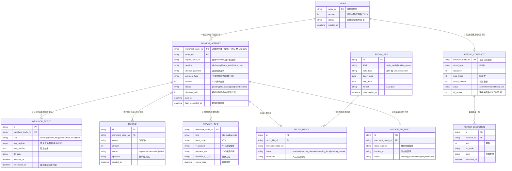

# 03-2. 資料模型（ER Diagram）

> 支撐金流整合所需的最小資料模型。命名為邏輯名稱，各專案可映射到自己的實體表；欄位取捨理由見 §3。

## 1. ER Diagram

## 2. 唯一性與併發約束（金流正確性的底線）

| 約束 | 理由 |
|------|------|
| `PAYMENT_ATTEMPT.merchant_trade_no` UNIQUE | 官方規定不可重複；同時是回呼冪等的鎖定鍵 |
| 回呼處理採**條件式 UPDATE**（`WHERE status='pending'` 之類）而非先查後寫 | 綠界重送最多 4 次＋多節點部署下，check-then-act 必有 race；且 SET 必須改動 WHERE 用到的欄位，否則 READ COMMITTED 下兩個併發請求都會通過條件 |
| `WEBHOOK_EVENT` 永遠 INSERT（append-only），業務狀態只在 `PAYMENT_ATTEMPT` 更新 | 事件原文保留供稽核與重放分析；重送事件會有多筆 event，但狀態轉移只發生一次 |
| `REFUND` 與 `PAYMENT_ATTEMPT` 分表 | 一筆付款可多次部分退刷（一般授權），退款是獨立生命週期 |
| 金額欄位一律整數（TWD 無小數） | 官方規定；避免浮點誤差 |

## 3. 欄位取捨理由

- **`raw_payload` 必存**：對帳差異、客訴、與綠界爭議時的唯一證據；也支援日後「重放事件重建狀態」。
- **`simulate_paid` 必存**：官方明示 SimulatePaid=1 的交易不可出貨；漏存會導致測試交易觸發真實出貨。
- **`payment_type`（回傳值）與 `choose_payment`（送出值）分開存**：兩者值域不同（送 `Credit` 回 `Credit_CreditCard`），退款前要用回傳值判斷是否為信用卡類。
- **`ecpay_trade_no` 必存**：DoAction 退款需要 MerchantTradeNo＋TradeNo 雙識別，只存單邊會讓退款做不了。
- **`last_reconciled_at`**：讓每日對帳能以「未對帳」為查詢條件增量處理。
- **`fail_streak`**：官方規則「連續失敗 6 次自動取消」，本地需要鏡射此狀態以主動通知用戶。
