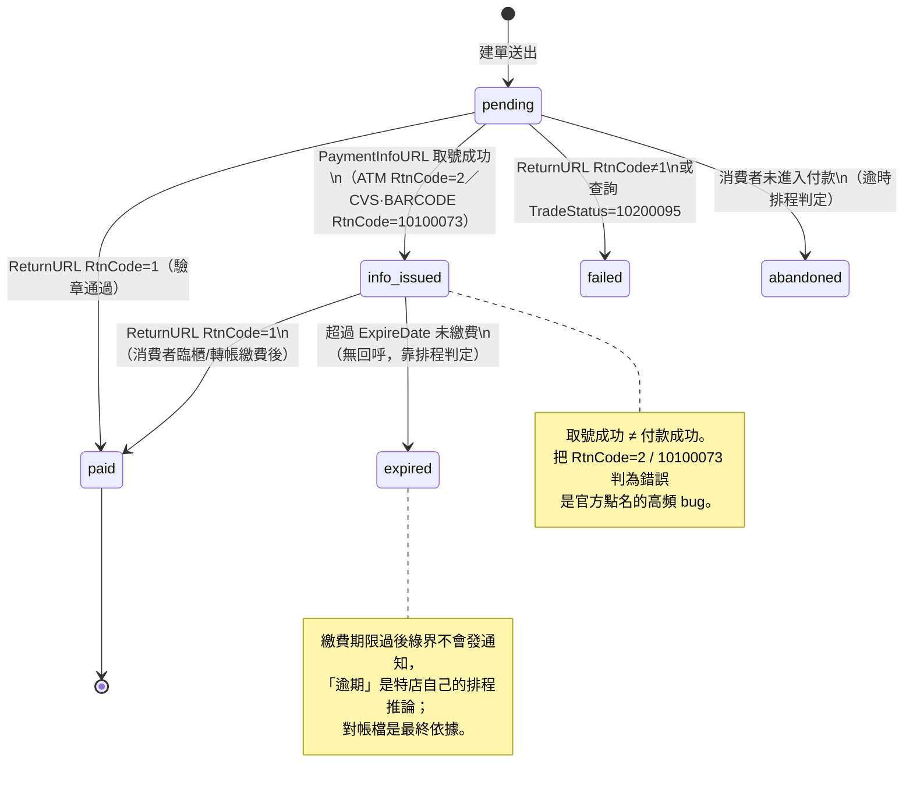
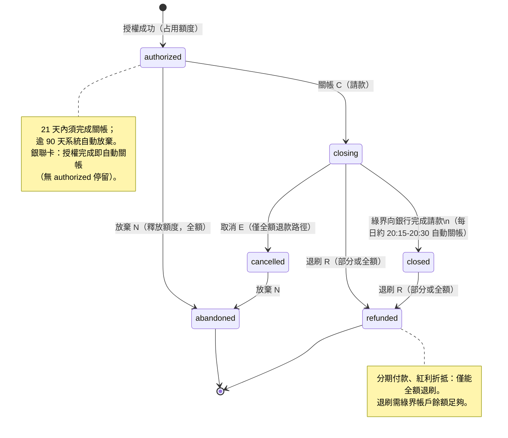
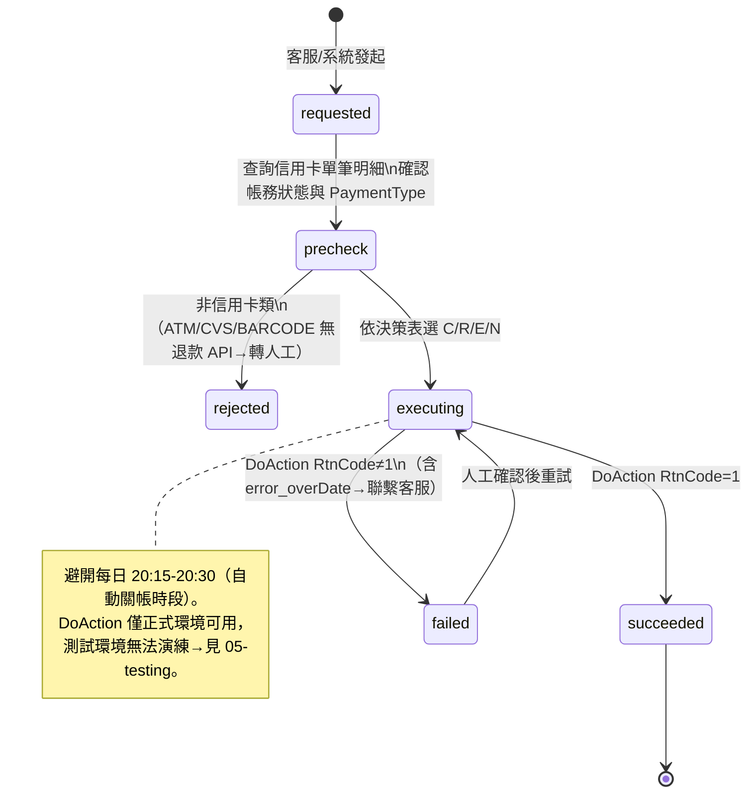
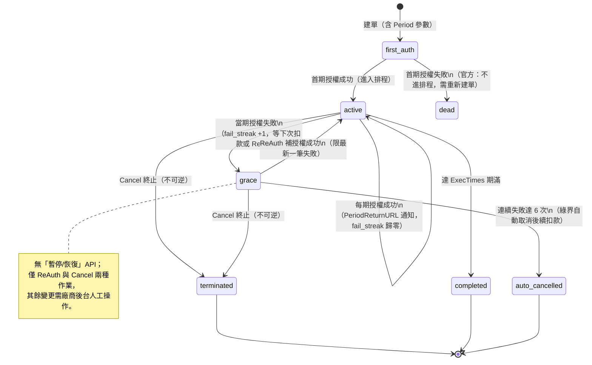
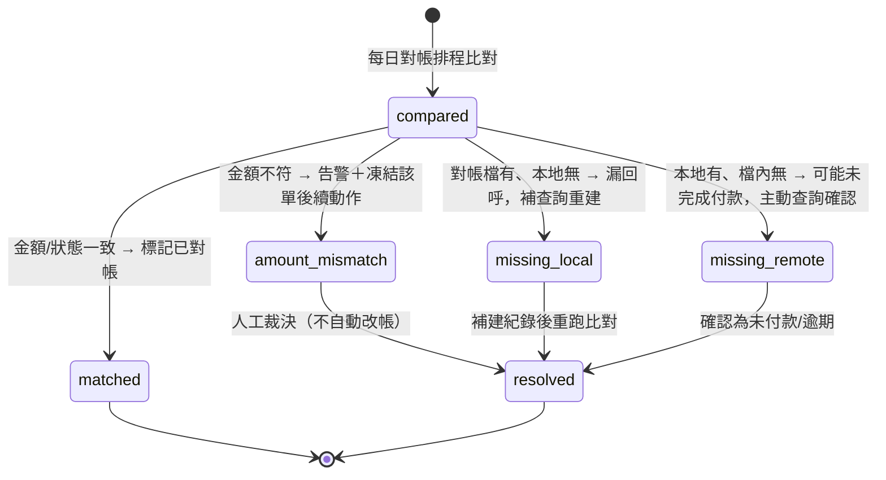

# 03-3. 狀態機（State Diagram）

> 金流正確性的核心是狀態機：每個狀態轉移只允許由「已驗章的回呼」「已驗章的查詢結果」或「對帳檔」觸發，且必須冪等。

## 1. 付款狀態機（特店本地，PAYMENT_ATTEMPT.status）

**轉移守則**：

1. `paid` 是吸收態：重送的 ReturnURL 到達時，狀態已是 `paid` 就只記 event、不再轉移（冪等）。
2. `SimulatePaid=1` 的通知可轉移狀態供測試，但**不得觸發出貨等副作用**。
3. BNPL 特例：`pending` 期間 TradeStatus=0 表示「申請受理中」而非未付款；只能等 ReturnURL，不可輪詢。

## 2. 信用卡帳務狀態機（綠界端，DoAction 操作對象）

依官方 2885 頁的動作與適用狀態整理：

**退款決策表**（由本地 Refund 模組實作）：

| 綠界帳務狀態 | 想全額退 | 想部分退 |
|-------------|---------|---------|
| 已授權（authorized） | 放棄 N | 不可（尚未請款） |
| 要關帳（closing） | 取消 E → 放棄 N | 退刷 R（僅一般授權） |
| 已關帳（closed） | 退刷 R | 退刷 R（僅一般授權） |
| 操作取消（cancelled） | 放棄 N | — |

## 3. 退款請求狀態機（特店本地）

## 4. 定期定額合約狀態機

## 5. 對帳比對結果狀態機

