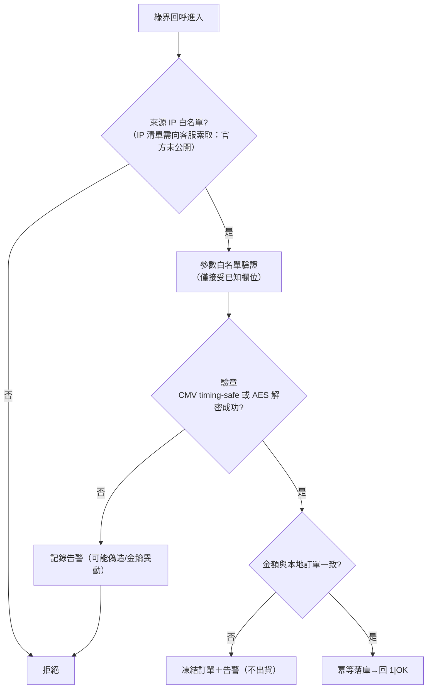

# 03-4. 安全設計

> 涵蓋：CheckMacValue 演算法（僅偽代碼）、AES-JSON 協議、金鑰管理、回呼端點防護、PCI 範圍。

## 1. CheckMacValue（CMV-SHA256）演算法

依官方「檢查碼機制說明」（2902）與「URLEncode 轉換表」（2904）。**僅描述演算法流程，不提供函式實作。**

### 1.1 核心偽代碼（Pseudo-code）

```text
FUNCTION ComputeCheckMacValue(params, hashKey, hashIV):
    # 步驟 1：排除 CheckMacValue 自身，其餘參數依「參數名稱」A→Z 字典序排序
    sorted ← SORT(params WHERE name ≠ "CheckMacValue") BY name ASCENDING
    # （首字母相同比次字母，依此類推）

    # 步驟 2：串接成 query string，前後加上金鑰
    raw ← "HashKey=" + hashKey
    FOR EACH (name, value) IN sorted:
        raw ← raw + "&" + name + "=" + value
    raw ← raw + "&HashIV=" + hashIV

    # 步驟 3：整串 URL encode（RFC 1866 行為：空格→'+'）
    encoded ← URL_ENCODE(raw)

    # 步驟 4：依官方「URLEncode 轉換表」還原 .NET 不編碼的字元
    #（各語言的 URL encode 行為不同，須逐一比對轉換表校正）
    encoded ← REPLACE(encoded, "%2d" → "-", "%5f" → "_", "%2e" → ".",
                               "%21" → "!", "%2a" → "*", "%28" → "(", "%29" → ")")

    # 步驟 5：全字串轉小寫
    lowered ← TO_LOWER(encoded)

    # 步驟 6：SHA256 雜湊
    digest ← SHA256(lowered)

    # 步驟 7：十六進位表示轉大寫 → 即 CheckMacValue
    RETURN TO_UPPER(HEX(digest))


FUNCTION VerifyCheckMacValue(receivedParams, hashKey, hashIV):
    expected ← ComputeCheckMacValue(receivedParams, hashKey, hashIV)
    received ← receivedParams["CheckMacValue"]
    # 必須使用 timing-safe 比較，禁止一般字串等號比較（timing attack）
    RETURN TIMING_SAFE_EQUAL(expected, received)
```

### 1.2 演算法層的已知陷阱（跨語言）

| 陷阱 | 說明 |
|------|------|
| 空格編碼 | 步驟 3 需得到 `+`（非 `%20`）；多數現代語言預設輸出 `%20`，需校正 |
| `~` 字元 | 多數語言不編碼 `~`，需依轉換表校正為 `%7e`（小寫階段） |
| 參數含 HTML 轉義 | 序列化時不得對 `<>&'` 做 HTML escape，否則雜湊必不符 |
| 驗證比較 | 一律 timing-safe；`==`/`===` 明確禁止 |
| NeedExtraPaidInfo=Y | 回呼「額外回傳的參數」**全部**要納入驗章，漏掉任一欄位驗證必失敗 |
| ItemName 超長 | 送出前先截斷到安全長度**再**計算 CMV；讓綠界端截斷會導致雙方雜湊不一致而掉單 |

> 物流家族使用 CMV-MD5（演算法同上、雜湊改 MD5 且金鑰不同）；金流家族一律 SHA256。兩者金鑰與演算法不可混用。

## 2. AES-JSON 協議（站內付 2.0／幕後授權／幕後取號）

### 2.1 請求／回應結構（三層）

```text
外層（明文 JSON）:
  MerchantID
  RqHeader { Timestamp（Unix 秒；官方時效驗證約 10 分鐘）, Revision（依服務而異） }
  Data ← AES_128_CBC_ENCRYPT( aesUrlEncode( COMPACT_JSON(業務參數) ), hashKey, hashIV ) 之 Base64

回應解析（雙層錯誤檢查，缺一不可）:
  1. 檢查外層 TransCode == 1（傳輸層成功）
  2. AES 解密 Data → urldecode → JSON parse
  3. 檢查內層 RtnCode 為成功值（業務層成功；型別為整數）
```

### 2.2 協議層規則

- `aesUrlEncode` 僅做 urlencode（空格→`+`、`~`→`%7E`），**無**轉小寫、**無** .NET 字元還原——與 CMV 的 encode 是兩套不同函式。
- Base64 必用標準 alphabet（`+/=`），不可用 URL-safe（`-_`）。
- JSON 序列化必須 compact 且不可 HTML-escape `<>&`。
- Timestamp 一律 Unix **秒**（毫秒要除以 1000）。
- RtnCode 型別：AES-JSON 為**整數** 1；CMV Form POST 為**字串** `"1"`。型別比對錯誤會讓所有成功交易被誤判失敗。

## 3. 金鑰管理

| 規則 | 說明 |
|------|------|
| 儲存 | HashKey/HashIV/MerchantID 一律 Secret Manager 或環境變數；禁止進版本控制、前端、日誌 |
| 測試/正式隔離 | 測試帳號為公開共用（所有開發者可見交易），正式金鑰絕不可用於測試環境設定檔 |
| 輪換 | ECPay 不支援雙金鑰並行，輪換需維護窗口：申請新鑰→測試環境驗證→低峰切換→小額實測→確認舊鑰失效；保留舊鑰 24 小時以備回退 |
| 洩漏處置 SOP | ①立即通知綠界客服重發金鑰 ②Feature Flag 暫停收款 ③後台清查洩漏期間交易 ④更新金鑰 ⑤清理 Git 歷史 ⑥覆盤 |
| 平台商 | 以 PlatformID 建單時，CheckMacValue 須用 PlatformID 配對的金鑰計算 |

## 4. 回呼端點防護



- **驗章通過後仍要比對金額**：官方要求特店自行判斷交易金額與狀態，驗章只證明訊息來自綠界，不證明與你的訂單相符。
- ReturnURL（S2S）不適用 CSRF Token；OrderResultURL 屬綠界前端 Form POST，**不可**強制 CSRF 驗證（會擋掉合法導轉），改以 ResultData 內容驗證。
- 從回呼取得的 TradeDesc/ItemName 等值顯示到頁面（或塞進 Email 模板）前必須 HTML escape。
- 錯誤回應不得洩漏內部資訊（堆疊、DB id）。

## 5. PCI DSS 範圍與資料保存

| 整合方式 | PCI 等級 | 卡號路徑 |
|---------|---------|---------|
| AIO 導轉 | SAQ-A | 卡號只出現在綠界頁面 |
| 站內付 2.0 | SAQ-A-EP | 卡號由前端元件直送綠界 |
| 幕後授權 | SAQ-D+ | 卡號經特店後端——選用前先確認組織能承擔完整 PCI 合規 |

- 特店資料庫**永不儲存完整卡號**；對帳檔中的卡號末 4 碼可存。
- 爭議款（Chargeback）：無 API，綠界以 Email 通知；交易憑證（出貨證明、簽收紀錄）建議保存至少 180 天。
