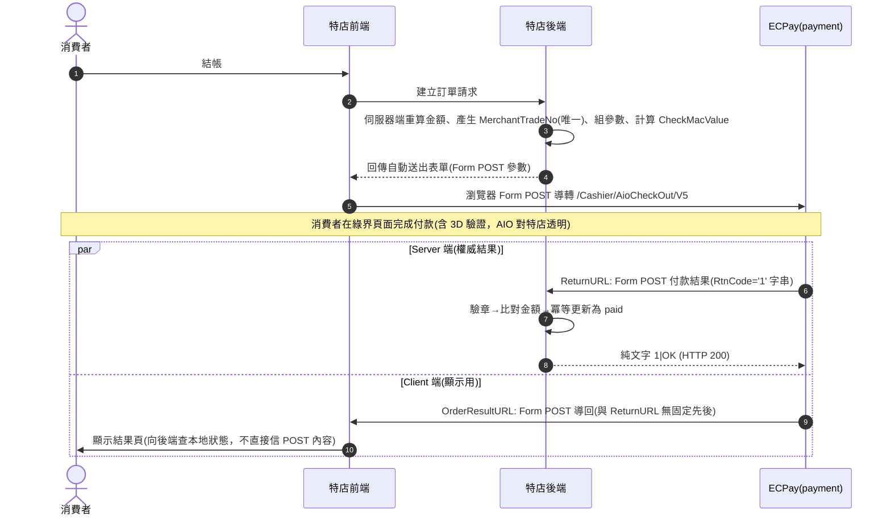
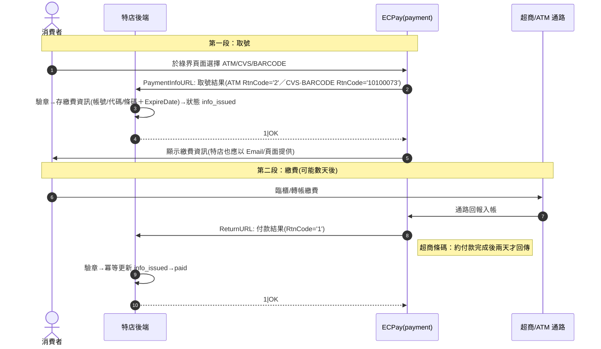
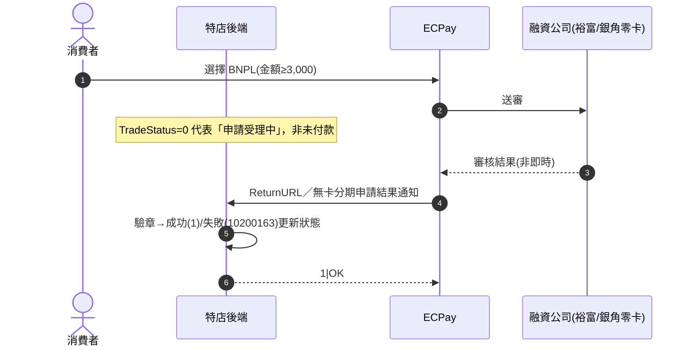
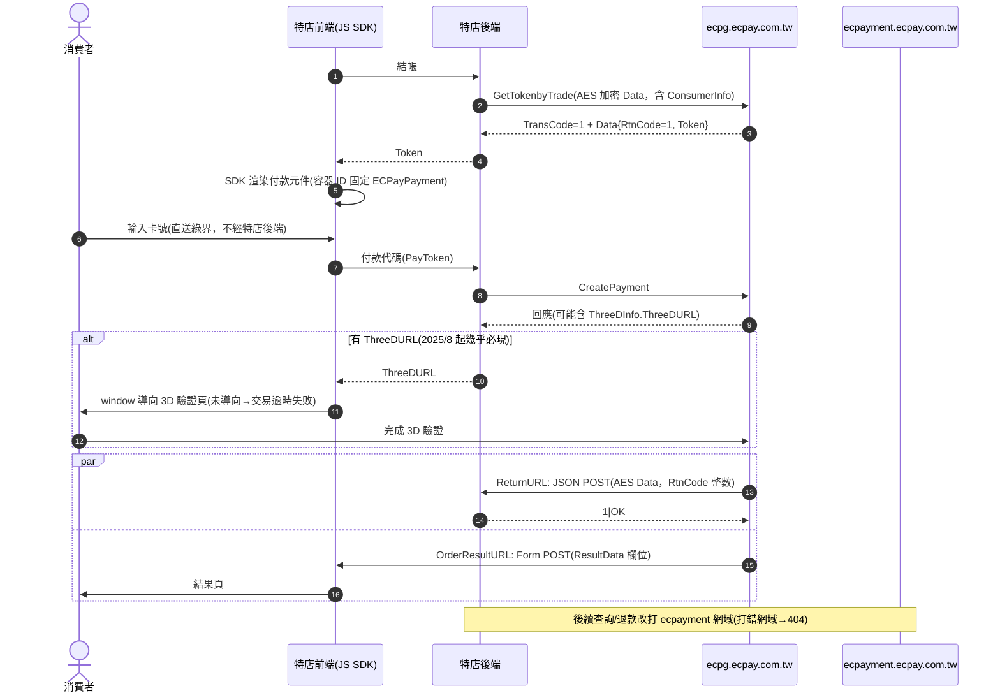
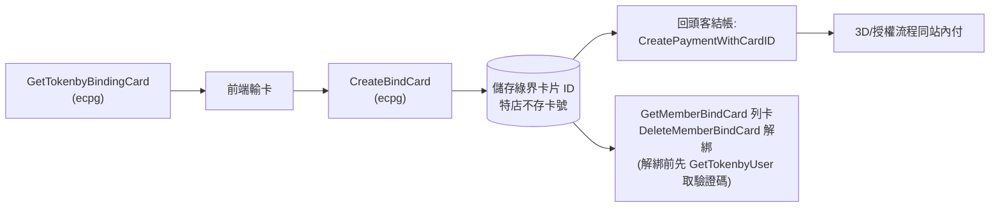

# 04-1. 付款流程（Payment Flows）

> 以 Sequence Diagram 表達三大類付款流程：即時付款（一段式）、取號付款（二段式）、嵌入式（站內付 2.0）。所有流程的共同前提：金額由伺服器端重算、建單參數伺服器端組裝與簽章。

## 1. AIO 即時付款（信用卡／WebATM／TWQR／微信／Apple Pay）

**規則**：

- OrderResultURL 僅供顯示；**訂單狀態只能由 ReturnURL（或主動查詢）驅動**。兩者到達順序不固定，結果頁需支援「付款處理中」的輪詢本地狀態。
- 銀聯卡與非即時交易不支援 OrderResultURL，結果頁一律要能在「只有 ClientBackURL 導回」的情況下運作。
- iframe 禁用；LINE/Facebook 內建 WebView 會導致付款失敗，需引導外部瀏覽器開啟。

## 2. AIO 取號付款（ATM／超商代碼／超商條碼）——二段式

**規則**：

- **必須同時實作 PaymentInfoURL 與 ReturnURL 兩個端點**；漏做 PaymentInfoURL 消費者拿不到繳費資訊。
- 取號成功碼（2／10100073）不是錯誤；把它判為失敗而取消訂單是官方點名的高頻 bug。
- 繳費期限（ExpireDate）過後不會有任何回呼，逾期判定靠本地排程＋對帳檔。
- 官方明示 ATM/CVS/BARCODE **不要主動輪詢**查詢 API，等回呼即可（客服個案查詢除外）。
- 超商代碼 `StoreExpireDate` 單位是分鐘、條碼是天——同名參數在不同付款方式單位不同。

## 3. BNPL 無卡分期（審核型）

- BNPL **只能**靠通知收結果，官方明示不可主動輪詢。

## 4. 站內付 2.0（嵌入式，AES-JSON、雙網域）

**規則**：

- 雙網域路由集中在傳輸模組，不允許呼叫端自行組 URL。
- 回應一律雙層檢查：TransCode（傳輸層）→ 解密 → RtnCode（業務層，整數）。
- ATM/CVS/BARCODE 走站內付時：CreatePayment 回應即含繳費資訊，需顯示給消費者；ReturnURL 於實際繳費後非同步到達。
- Apple Pay 需先完成網域驗證、Merchant ID 申請、憑證上傳，按鈕才會顯示。

## 5. 綁定信用卡（Token 快付）

## 6. 幕後授權／幕後取號（純後台）

- **幕後授權**（BackAuth）：特店自建輸卡介面→後端送卡號授權。流程最短但 PCI SAQ-D；ReturnURL 為 JSON POST、回 `1|OK`。
- **幕後取號**（GenPaymentCode）：後端直接產生 ATM 帳號/超商代碼/條碼，自行呈現給消費者；繳費結果經付款結果通知（JSON）到達，其後流程同 §2 第二段。

## 7. 建單參數組裝的通用檢核（送出前）

1. 金額為正整數、與伺服器端重算結果一致。
2. MerchantTradeNo ≤20 英數、資料庫 UNIQUE 先行占位。
3. MerchantTradeDate 為 UTC+8。
4. ItemName ≤400 字元（先截斷再簽章）、無 HTML 標籤、無控制字元、無系統指令關鍵字（WAF）。
5. ReturnURL/OrderResultURL/ClientBackURL 三者互異、皆為 80/443、非 CDN、非中文網址。
6. 依付款方式附掛正確的專屬參數（見 `02-api-capability-matrix.md` §1.2）。
