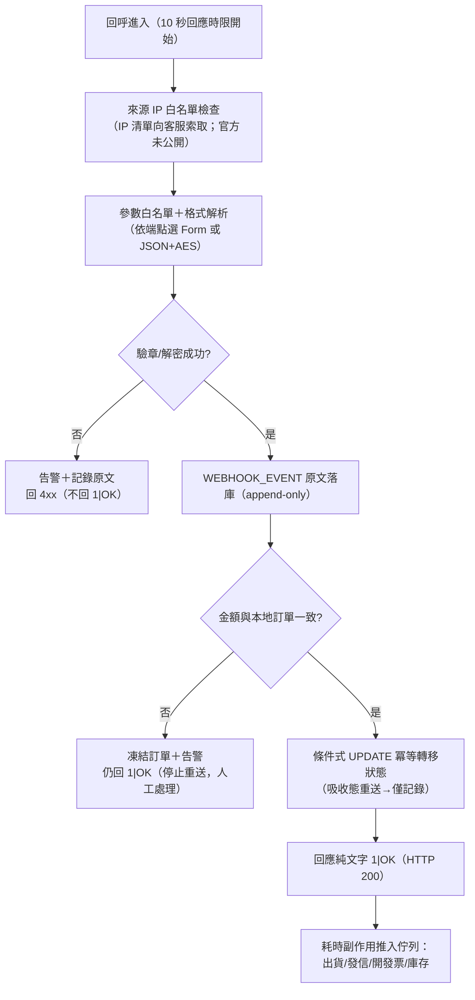
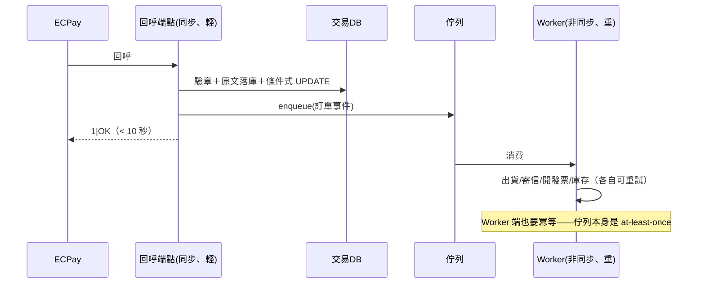

# 04-2. Webhook（回呼）處理流程

> 回呼是訂單狀態的權威來源，也是整個整合中最容易出錯的環節。本章定義接收架構、冪等設計、重送因應與佇列化。

## 1. 回呼端點清單與格式差異（設計時逐一對表）

| 端點 | 服務 | 請求格式 | RtnCode 型別 | 正確回應 |
|------|------|---------|:-----------:|---------|
| ReturnURL | AIO | Form POST（urlencoded） | 字串 `'1'` | 純文字 `1\|OK` |
| PaymentInfoURL | AIO | Form POST | 字串（`'2'`／`'10100073'`＝取號成功） | `1\|OK` |
| PeriodReturnURL | AIO 定期定額 | Form POST | 字串 | `1\|OK` |
| 無卡分期申請結果通知 | AIO BNPL | Form POST | 字串 | `1\|OK` |
| OrderResultURL | AIO | 前端 Form POST 導轉 | 字串 | HTML 結果頁（非 `1\|OK`） |
| ReturnURL | 站內付 2.0／幕後授權／幕後取號 | JSON POST（AES Data） | 整數 `1` | 純文字 `1\|OK` |
| OrderResultURL | 站內付 2.0 | Form POST（`ResultData` 欄位含 JSON，再 AES 解密） | 整數 | HTML 結果頁 |

**`1|OK` 的精確要求**：純 ASCII、無引號、無換行、無 BOM、無 HTML；HTTP Status 必須是 200（201/202/204 一律視為失敗觸發重送）。常見錯誤格式：`"1|OK"`、`1|ok`、`1OK`、空白。

## 2. 標準接收流程

**時限預算**：整條同步路徑（B→J）必須在 10 秒內完成，建議 P95 < 3 秒。任何外部 API 呼叫（寄信、開發票）都不允許出現在同步路徑上。

## 3. 冪等設計（核心）

**威脅模型**：綠界在未收到正確回應時會重送（AIO：每 5–15 分鐘、當天最多 4 次；ECPG 家族重送節奏：**官方未說明**）；多節點部署下同一通知可能同時到達兩個節點；ReturnURL 與 OrderResultURL 也可能並發觸發同一訂單的讀寫。

**設計規則**：

1. 冪等鍵＝`MerchantTradeNo`（＋通知類型）。
2. 狀態轉移用**條件式 UPDATE**（`... WHERE merchant_trade_no = ? AND status = '前置狀態'`），以「受影響列數」判斷是否為首次處理；**禁止**先 SELECT 再 UPDATE 的 check-then-act。
3. 條件式 UPDATE 的 SET 必須改動 WHERE 引用的欄位（如 status 本身），否則 READ COMMITTED 下並發的第二個請求重新評估條件仍會命中，兩邊都以為自己搶到。
4. 副作用（出貨、寄信）只在「首次轉移成功」的分支觸發；重送分支只補記 event。
5. `SimulatePaid=1`（模擬付款）：可更新狀態，但一律跳過副作用。
6. 事件表 append-only：同一通知重送 4 次＝4 筆 event＋1 次狀態轉移。

## 4. 佇列化架構

- Serverless 平台**禁止 fire-and-forget**：回應後執行環境可能凍結；用平台的 waitUntil 或外部佇列。
- Worker 失敗不影響 `1|OK` 已回的事實——回應只代表「已收到」，不代表業務完成；業務失敗由 Worker 的重試與死信佇列處理。

## 5. 漏收回呼的恢復策略

| 層級 | 手段 | 時機 |
|------|------|------|
| 1 | 綠界自動重送 | 被動，最多當天 4 次（AIO） |
| 2 | 主動查詢（QueryTradeInfo） | 信用卡/TWQR 類：建單後 10 分鐘未收到通知即查（見 `04-flows/03`） |
| 3 | 定期掃描 | 每小時撈「pending 超過門檻」的訂單批次查詢 |
| 4 | 每日對帳檔 | 最終防線，漏單在此一定會現形（見 `04-flows/04`） |

## 6. 端點基礎設施要求

- HTTPS（port 443）或 HTTP（port 80），**其他 port 收不到回呼**；本機開發需 tunneling 工具轉發。
- 不可置於 CDN 之後（CDN 會改變來源或攔截非瀏覽器請求）。
- Load Balancer 健康檢查涵蓋回呼路徑；SSL 憑證到期監控。
- 回呼處理的例外必須全捕獲——程式錯誤導致 500 等同未回應，會觸發重送風暴。
