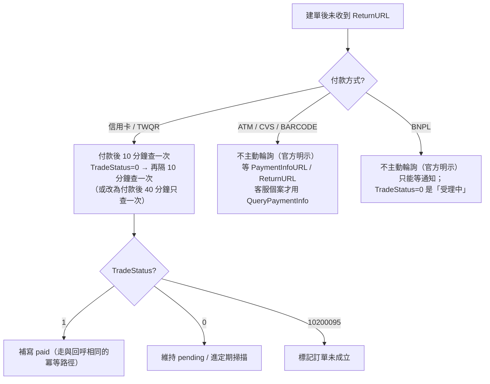

# 04-3. 主動查詢（Query）策略

> 查詢是回呼的補救手段，不是替代品。本章定義「何時查、查哪個 API、查太兇的後果」。

## 1. 查詢 API 家族對照

| 查詢需求 | AIO 端點 | ECPG 端點（ecpayment） | 回應格式 |
|---------|---------|----------------------|---------|
| 訂單付款狀態 | `/Cashier/QueryTradeInfo/V5` | `/1.0.0/Cashier/QueryTrade` | URL-encoded／AES-JSON |
| 信用卡帳務明細（退款前置） | `/CreditDetail/QueryTrade/V2` | `/1.0.0/CreditDetail/QueryTrade` | JSON／AES-JSON |
| ATM/CVS/BARCODE 取號結果 | `/Cashier/QueryPaymentInfo` | `/1.0.0/Cashier/QueryPaymentInfo` | URL-encoded／AES-JSON |
| 定期定額合約與明細 | `/Cashier/QueryCreditCardPeriodInfo` | `/1.0.0/Cashier/QueryTrade`（參數區分） | JSON／AES-JSON |
| 發卡行（僅幕後授權家族） | — | `/1.0.0/Cashier/QueryCardInfo` | AES-JSON |
| CVS 三段式條碼（僅幕後取號） | — | `/1.0.0/Cashier/QueryCVSBarcode` | AES-JSON |

## 2. 官方明定的查詢節奏（依付款方式分流）

## 3. 技術約束

| 約束 | 內容 | 設計因應 |
|------|------|---------|
| TimeStamp 時效 | QueryTradeInfo 的 TimeStamp（Unix 秒）僅 **3 分鐘**有效 | 每次請求即時產生；主機 NTP 校時 |
| 限流 | 呼叫過快 → HTTP 403，需等約 **30 分鐘**恢復；門檻值**官方未說明**（基於 IP＋MerchantID） | 查詢排程集中管理、請求間隔（**社群觀察值**：≥200ms）、收到 403 即熔斷 30 分鐘並告警 |
| 多筆核對 | 官方建議多筆查詢改用對帳媒體檔 | 批次核對一律走 `04-flows/04`，查詢 API 只用於單筆即時需求 |
| 驗章 | 查詢回應同樣帶 CheckMacValue，必須驗證後才採信 | 與回呼共用驗章模組 |

## 4. 查詢結果的採用規則

1. 查詢結果與回呼**走同一條冪等狀態轉移路徑**——不論狀態由誰驅動，轉移規則只有一套。
2. 官方建議收到付款通知後可再以查詢 API 二次確認（縱深防禦）；是否啟用依風險承受度決定，啟用時注意限流預算。
3. 查詢到 `paid` 但本地已 `paid`：只記 log，不重複副作用。
