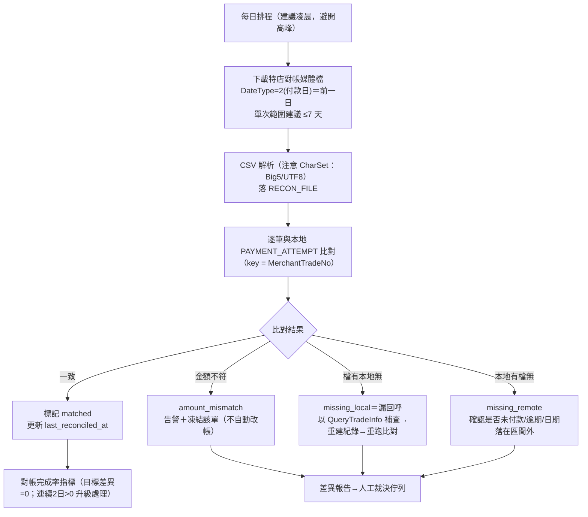
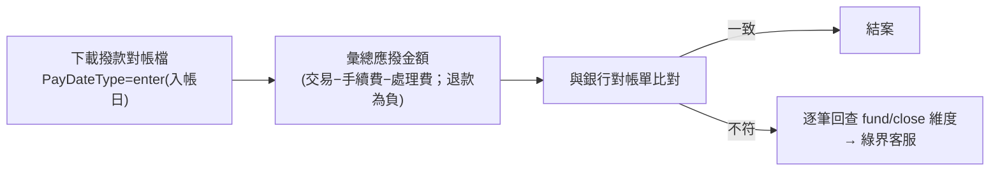
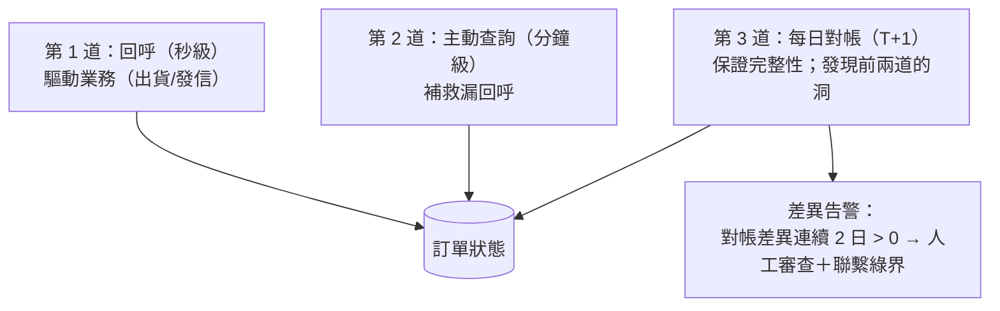

# 04-4. 對帳（Reconciliation）流程

> 對帳是金流正確性的最終防線：回呼會漏、查詢有限流，只有對帳檔保證完整。官方建議每日呼叫。

## 1. 兩種對帳檔（用途不同，都要接）

| | 特店對帳媒體檔 | 信用卡撥款對帳檔 |
|--|---------------|-----------------|
| 端點 | `vendor.ecpay.com.tw/PaymentMedia/TradeNoAio`（**專用網域**） | `payment.ecpay.com.tw/CreditDetail/FundingReconDetail` |
| 內容 | 全部付款方式的交易明細（訂單/付款/撥款狀態、手續費） | 信用卡請/退款的撥款明細（結算、手續費、撥款金額；退款為負數） |
| 對帳目的 | **交易對帳**：本地訂單 vs 綠界交易（漏單、金額、狀態） | **資金對帳**：綠界應撥 vs 銀行實際入帳 |
| 日期參數 | DateType：2=付款日、4=撥款日、6=訂單日 | PayDateType：fund=結算日、close=關帳日、enter=撥款入帳日 |
| 格式 | CSV；MediaFormated：0=V1（16 欄）、1=V2（30 欄）、2=V3（2025/4 起，手續費細分） | CSV（授權單號、關帳單號、交易/請款日期、金額、手續費、%數、撥款金額） |
| 限制 | 需後台預設 IP 白名單；**同 IP 每分鐘限 1 份**；查無資料回空檔（僅欄位列） | **測試環境不可用**；銀行上班日 14:00 後才有資料；今日訂單隔日 14:00 後可查 |
| 官方頁 | 2896 | 2898 |

> ECPG 家族另有 `/1.0.0/Cashier/QueryTradeMedia`（撥款對帳下載），語意對應撥款對帳。

## 2. 每日交易對帳流程

**節奏與防呆**：

- 相鄰下載請求間隔 ≥1 分鐘（官方限制同 IP 每分鐘 1 份）；批次下載多天要序列化。
- 檔案為空 ≠ 失敗（查無資料僅回欄位列）；錯誤訊息會寫在「備註／廠商備註」欄位，解析時要讀。
- 對帳結果**只產生報告與告警，不自動修改帳務**——修帳一律人工裁決（`03-architecture/03-state-machines.md` §5）。
- 邊界情境：跨日付款（付款日與訂單日不同天）用 DateType 區分重跑；退款後的訂單在媒體檔會反映退款日期與金額欄位。

## 3. 每月／每週資金對帳流程（信用卡）

## 4. 主動對帳與回呼／查詢的關係（三道防線總圖）

## 5. 需監控的對帳指標

| 指標 | 目標 | 異常處理 |
|------|------|---------|
| 每日差異筆數 | 0 | >0 連續 2 日：人工審查＋綠界客服 |
| missing_local 比率 | ≈0 | 升高代表回呼端點故障（檢查 SSL/防火牆/CDN 設定） |
| 對帳檔下載成功率 | 100% | 失敗檢查 IP 白名單設定與 vendor 網域可達性 |
| 手續費合計 | 與費率合約一致 | V3 格式起手續費/處理費分欄，逐項核對 |
