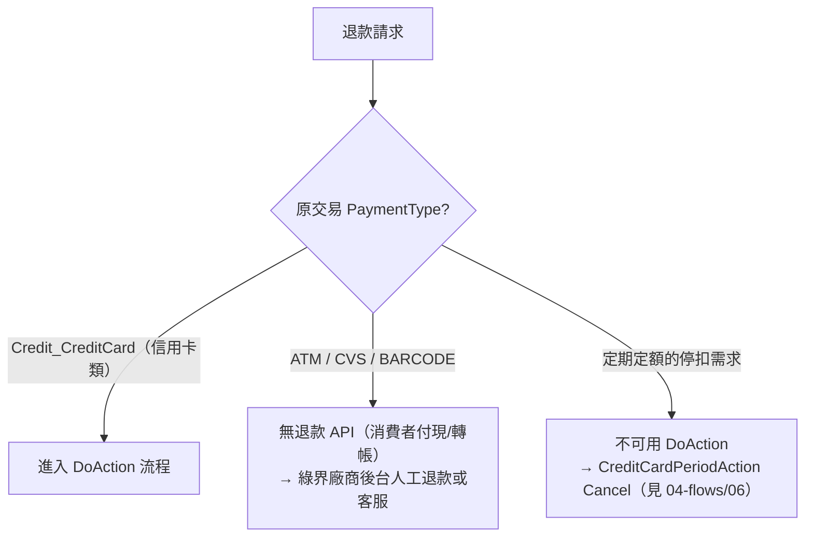
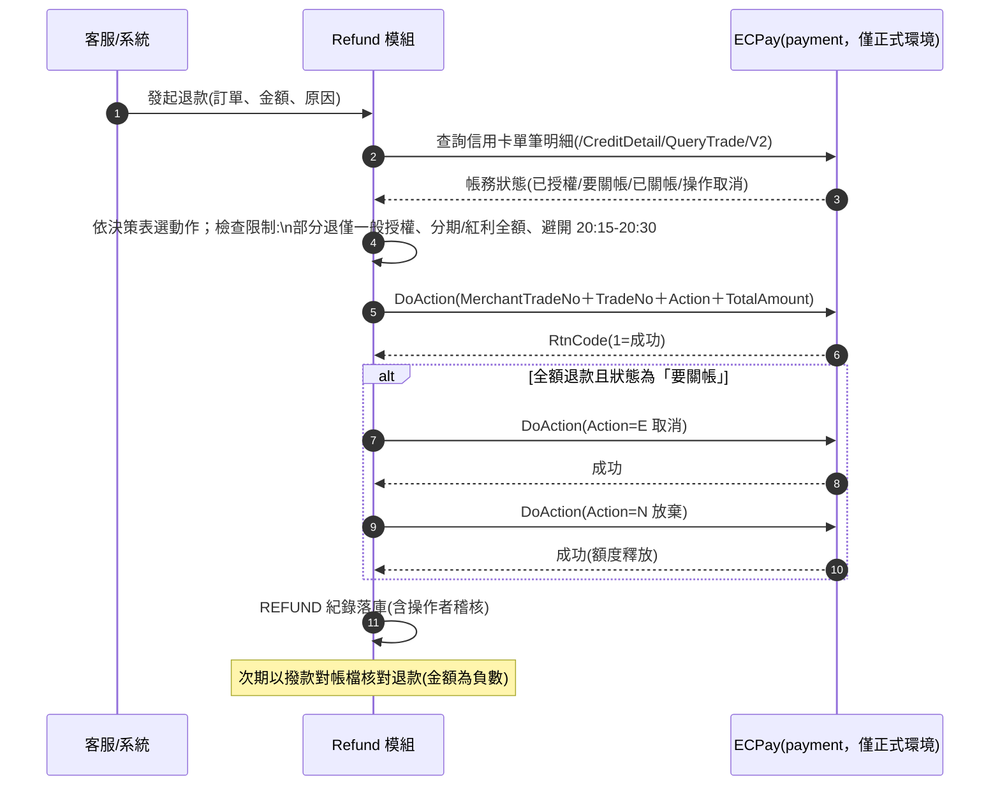

# 04-5. 退款（Refund）流程

> 依官方「信用卡請退款功能」（2885）。退款不是單一 API 呼叫，而是「查帳務狀態 → 依狀態機選動作 → 執行 → 核對」的流程。

## 1. 適用範圍（先擋掉不可退的）

## 2. DoAction 四動作與完整退款流程

| Action | 名稱 | 語意 |
|:------:|------|------|
| C | 關帳 | 請款（向銀行請款）；每日約 20:15–20:30 系統也會自動關帳 |
| R | 退刷 | 退款（部分或全額；分期/紅利僅全額） |
| E | 取消 | 取消「要關帳」狀態（全額退款的前置步驟） |
| N | 放棄 | 放棄交易、釋放信用卡額度（一律全額） |

**決策表**（同 `03-architecture/03-state-machines.md` §2）：

| 綠界帳務狀態 | 全額退款 | 部分退款 |
|-------------|---------|---------|
| 已授權 | N | 不可 |
| 要關帳 | E → N（兩步） | R（僅一般授權） |
| 已關帳 | R | R（僅一般授權） |
| 操作取消 | N | — |

## 3. 硬性限制（官方明列）

1. **僅正式環境可用**——測試環境無實際授權，DoAction 不可測（測試策略見 `05-testing/03`）。
2. 關帳時限：授權後 **21 天**內須關帳，逾期 API 不可用（`error_overDate` → 聯繫客服）；逾 **90 天**系統自動放棄。
3. 每日 20:15–20:30（自動關帳時段）勿呼叫。
4. 分期付款、紅利折抵：**只能全額退刷**；部分退刷僅適用一般授權。
5. 銀聯卡：授權完成即自動關帳；「要關帳」狀態不可執行取消（E）。
6. 退刷上限為原訂單金額；退刷需綠界帳戶餘額足夠，不足會失敗。
7. DoAction 不能停用定期定額。

## 4. 業務層補償設計（跨服務）

退款成功後應觸發的補償動作（由佇列驅動，各自冪等）：

| 補償 | 說明 |
|------|------|
| 訂單狀態回寫 | `REFUND.succeeded` → 訂單進入退款完成狀態 |
| 電子發票 | 已開發票需**作廢**（全額）或**折讓**（部分）——呼叫發票 API 家族（見 `04-flows/07`） |
| 物流 | 已出貨需啟動逆物流（物流家族，非本藍圖範圍） |
| 通知 | 消費者退款確認信（金額、原路退回說明） |
| 對帳 | 下期撥款對帳檔中以負數核對退款金額 |
