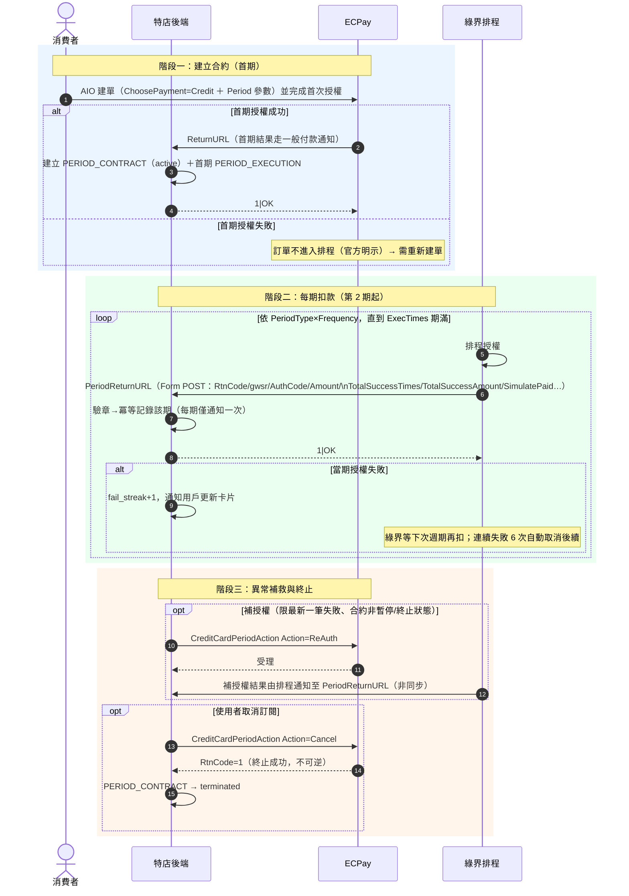

# 04-6. 定期定額（Subscription）流程

> 官方支援的訂閱能力（AIO：2868／5631／2892／2900；ECPG 有對應端點）。本章聚焦時序流程；合約狀態機見 `03-architecture/03-state-machines.md` §4。

## 1. 能力邊界（先確認官方支援什麼）

| 能力 | 官方支援 | 備註 |
|------|:-------:|------|
| 建立定期定額合約 | ✅ | AIO 建單帶 Period 參數；ECPG 亦支援 |
| 每期自動扣款 | ✅ | 綠界排程執行，特店無需觸發 |
| 每期結果通知 | ✅ | PeriodReturnURL（第 2 期起；首期回 ReturnURL） |
| 查詢合約與各期明細 | ✅ | QueryCreditCardPeriodInfo |
| 補授權失敗交易 | ✅ | CreditCardPeriodAction：ReAuth（限最新一筆失敗） |
| 終止合約 | ✅ | CreditCardPeriodAction：Cancel（**不可逆**） |
| 暫停／恢復 | ❌ | **無此 API**；其他變更需廠商後台人工操作 |
| 變更金額／週期 | ❌ | 無 API；只能終止後建新合約 |
| 銀聯卡定期定額 | ❌ | 僅 VISA／MASTER／JCB |
| 與分期、紅利折抵並用 | ❌ | 官方明示不可同時設定 |

**參數規則**（建立時一次定案，之後不可改）：

- `PeriodAmount` 每期金額＝`TotalAmount`（每期相同）
- `PeriodType`：D（天）／M（月）／Y（年）
- `Frequency`：D→1–365、M→1–12、Y→1
- `ExecTimes`：≥2；D/M ≤999、Y ≤99
- 月／年扣款遇無該日期（如 31 號）以月底扣款

## 2. 完整生命週期時序

## 3. PeriodReturnURL 通知處理要點（官方 5631）

1. **首期走 ReturnURL、第 2 期起走 PeriodReturnURL**——兩個端點都要實作，狀態轉移共用同一套冪等規則。
2. 通知含累計欄位（`TotalSuccessTimes`／`TotalSuccessAmount`），本地累計值應與之核對，不符即告警（偵測漏期）。
3. **每期僅通知一次**；未收到通知時，用「信用卡定期定額訂單查詢」取得實際授權結果（不可空等）。
4. `SimulatePaid=1`（廠商後台模擬付款）：不撥款，勿觸發服務開通等副作用。
5. RtnCode≠1 勿視為終止——合約仍在，等下次週期或 ReAuth。
6. 未設 PeriodReturnURL 時只能人工登入後台核對授權狀態——**藍圖規定一律必設**。

## 4. 對帳與訂閱的交互

- 每期成功授權都是一筆獨立交易，會出現在特店對帳媒體檔與信用卡撥款對帳檔中；每日對帳需能把「同一合約的多期交易」正確歸戶（以合約 MerchantTradeNo＋gwsr 授權單號對應）。
- 退款：單期退款走 DoAction（對該期授權單），限制同 `04-flows/05`；停止後續扣款走 Cancel——**兩者是不同操作，不可混用**（官方明示 DoAction 不支援停用定期定額）。

## 5. 測試限制（銜接 `05-testing/03`）

- ReAuth 補授權在測試環境**不可測**。
- 每期排程扣款在測試環境的觸發時機由綠界系統決定；訂閱完整生命週期的驗證主要靠正式環境小額合約＋盡早 Cancel。
