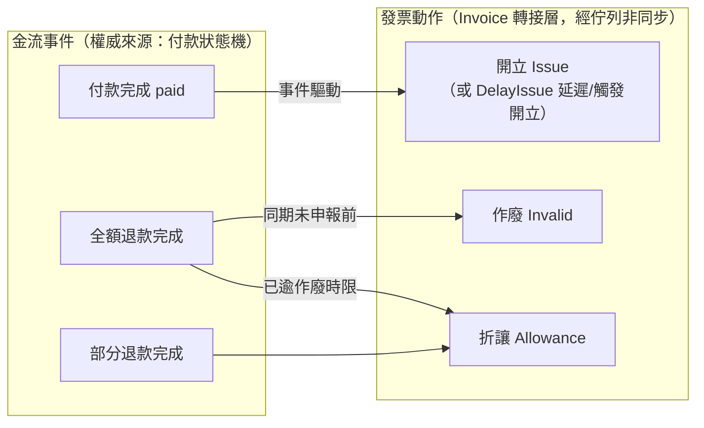
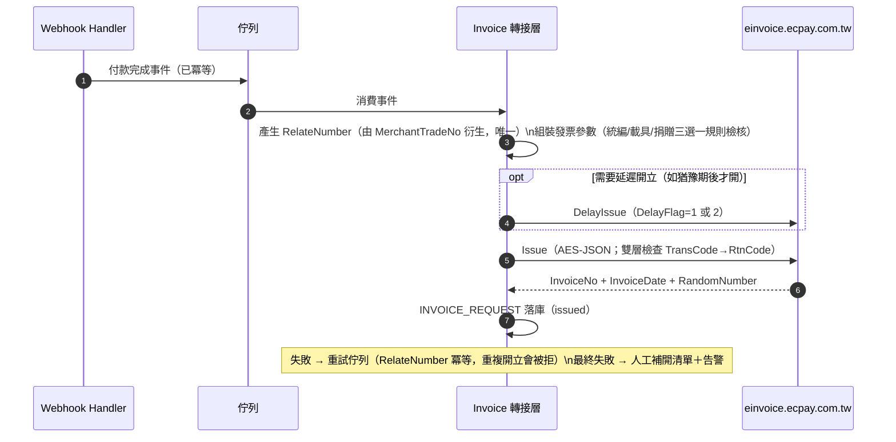
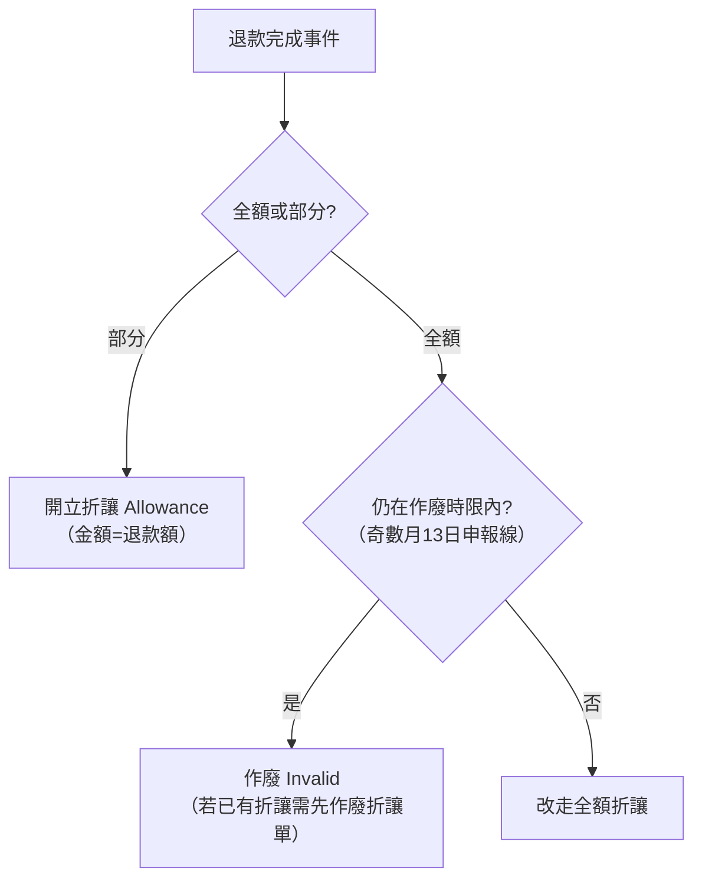

# 04-7. 電子發票（Invoice）與金流的整合

> 官方支援電子發票（B2C／B2B），為獨立的 API 家族（`einvoice.ecpay.com.tw`，AES-JSON 協議）。本章盤點其能力並定義「金流事件 → 發票動作」的整合觸點。台灣落地電商的發票是法遵必需品，藍圖將其視為金流閉環的一部分。

## 1. 與金流的關係（架構定位）

**設計規則**：

1. 發票動作一律由佇列驅動、非同步執行——**發票失敗不得阻塞或回滾金流**（金流已成立是事實，發票可補開）。
2. 發票與金流使用**不同的 MerchantID／HashKey／HashIV**（各服務帳號獨立配對），金鑰管理需分組。
3. `RelateNumber`（發票關聯編號，≤50 字元、唯一、**大小寫視為相同**）建議由 MerchantTradeNo 衍生且單一出處實作，保證「一筆付款最多一張發票」的冪等。

## 2. B2C 發票能力盤點（`/B2CInvoice/*`，Revision 3.0.0）

### 2.1 前置作業（上線前一次性）

| API | 端點 | 用途 |
|-----|------|------|
| 查詢財政部配號結果 | `/B2CInvoice/GetGovInvoiceWordSetting` | 取得財政部核配的字軌 |
| 字軌與配號設定 | `/B2CInvoice/InvoiceWordSetting` | 將字軌設定至綠界 |
| 設定字軌號碼狀態 | `/B2CInvoice/UpdateInvoiceWordStatus` | 啟用／停用字軌 |
| 查詢字軌 | `/B2CInvoice/GetInvoiceWordSetting` | 核對設定 |

> 字軌未設定或用罄會導致開立失敗——營運上需監控字軌餘量（見 §6）。

### 2.2 資料驗證（開立前防呆）

| API | 端點 | 用途 |
|-----|------|------|
| 統一編號驗證 | `/B2CInvoice/CheckCompanyIdentifier` | 8 碼統編有效性（官方：僅回應代碼 1200125 才停止開立，其他代碼應繼續完成開立） |
| 手機條碼驗證 | `/B2CInvoice/CheckBarcode` | `/` 開頭共 8 碼；誤碼會導致歸戶失敗 |
| 捐贈碼驗證 | `/B2CInvoice/CheckLoveCode` | 3–7 位數字 |

### 2.3 開立

| API | 端點 | 用途／規則 |
|-----|------|-----------|
| 一般開立 | `/B2CInvoice/Issue` | 即時開立。回傳 InvoiceNo（10 碼）、InvoiceDate、RandomNumber |
| 延遲開立 | `/B2CInvoice/DelayIssue` | `DelayFlag=1`：指定 DelayDay（1–15 天）後**自動開立**；`DelayFlag=2`：暫存，待**觸發開立**（DelayDay 0–15，觸發後再延遲該天數；不觸發則永不開立）。以 `Tsr` 交易單號作為觸發依據（唯一值） |
| 觸發開立 | `/B2CInvoice/TriggerIssue` | 以 Tsr 觸發 DelayFlag=2 的暫存發票 |
| 編輯延遲開立 | `/B2CInvoice/EditDelayIssue` | 修改暫存中的延遲發票 |
| 取消延遲開立 | `/B2CInvoice/CancelDelayIssue` | 官方：開立當天 10 點後無法取消（將自動開立） |

**開立參數的關鍵商業規則**（官方 7896）：

- 三選一的發票去向：**捐贈**（Donation=1＋LoveCode，不可有統編）／**統編**（CustomerIdentifier，Donation 必為 0）／**載具**（CarrierType：1=綠界、2=自然人憑證、3=手機條碼、4=悠遊卡、5=一卡通）。
- Print=1（列印）時 CustomerName／CustomerAddr 必填；有統編且要存載具時 CarrierType 僅可為 3。
- CustomerPhone 與 CustomerEmail 至少一項必填。
- 金額規則：所有 `ItemAmount`（含稅小計）加總四捨五入＝`SalesAmount`（含稅總額）；混稅（TaxType=9）僅允許「應稅＋免稅」或「應稅＋零稅率」組合；商品最多 999 項；商品單位僅接受半形。
- 零稅率（TaxType=2/9）：ClearanceMark 必填；自 2026（民國 115）年起 ZeroTaxRateReason 必填。

### 2.4 折讓與作廢（退款的發票補償）

| API | 端點 | 用途／限制 |
|-----|------|-----------|
| 一般開立折讓 | `/B2CInvoice/Allowance` | 紙本折讓（部分退款） |
| 線上開立折讓 | `/B2CInvoice/AllowanceByCollegiate` | 通知消費者線上同意；**其 Callback 為 Form POST＋CheckMacValue MD5、回應 `1\|OK`——是發票家族中唯一帶 CMV 的回呼，需獨立的接收端點** |
| 取消線上折讓 | `/B2CInvoice/CancelAllowance` | 取消尚未同意的線上折讓 |
| 作廢發票 | `/B2CInvoice/Invalid` | 全額作廢。**時限**：每年奇數月 13 號 23:59:59 後，前兩個月的發票因已申報財政部而無法作廢（如 3/14 起不能作廢 1、2 月發票）；已有折讓的發票須先作廢全部折讓單 |
| 作廢折讓 | `/B2CInvoice/AllowanceInvalid` | 作廢折讓單 |
| 註銷重開 | `/B2CInvoice/VoidWithReIssue` | 開錯重開（一次呼叫完成註銷＋重開） |

### 2.5 查詢與通知

| API | 端點 |
|-----|------|
| 查詢發票明細 | `/B2CInvoice/GetIssue` |
| 查詢特定多筆發票 | `/B2CInvoice/GetIssueList` |
| 依關聯編號查詢 | `/B2CInvoice/GetIssueByRelateNo` |
| 查詢折讓明細／作廢發票／作廢折讓 | `/B2CInvoice/GetAllowance`、`/GetInvalid`、`/GetAllowanceInvalid` |
| 發送發票通知（Email/簡訊） | `/B2CInvoice/InvoiceNotify` |
| 發票列印 | `/B2CInvoice/InvoicePrint` |

## 3. B2B 發票（`/B2BInvoice/*`，Revision 1.0.0）

- 與 B2C 的協議差異：RqHeader 需**額外帶 RqID（UUID，唯一請求識別碼）**；端點前綴不同。
- 兩種模式：**交換模式**（買受方需線上確認，故多出 Confirm 系列 API：IssueConfirm／AllowanceConfirm／InvalidConfirm／AllowanceInvalidConfirm）與**存證模式**（單向存證）。
- 能力集合同樣涵蓋：開立、折讓、作廢、作廢折讓、各查詢。

## 4. 金流 → 發票整合時序（標準電商）

**退款時的發票補償決策**：

## 5. 協議注意事項（發票家族特有）

- AES-JSON 三層結構同 ECPG（見 `03-architecture/04-security.md` §2），Timestamp 時效 10 分鐘。
- 綠界收到開立後**隔日**上傳財政部平台——「開立成功」≠「已申報」，作廢時限由此而來。
- 需在防火牆放行綠界通知來源 `postgate.ecpay.com.tw`（測試：`postgate-stage`）TCP 443（官方 15369 頁）。
- 測試環境勿帶真實 Email（個資）；測試環境不提供 NotifyURL 開立通知與發信。
- 多組字軌（ProductServiceID）需業務開通後才可使用。

## 6. 營運監控（發票特有）

| 監控項 | 說明 |
|--------|------|
| 字軌餘量 | 餘量不足前告警（查詢字軌 API 定期檢查） |
| 開立失敗率 | 失敗進補開清單；RelateNumber 重複（1200 系列錯誤）代表冪等生效而非故障 |
| 「已付款未開票」差異 | 每日核對 paid 訂單 vs INVOICE_REQUEST.issued，差異=補開對象 |
| 作廢時限日曆 | 奇數月 13 日申報線前，清點待作廢發票 |
