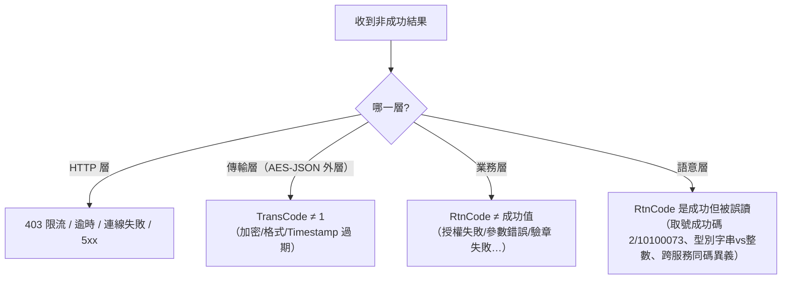
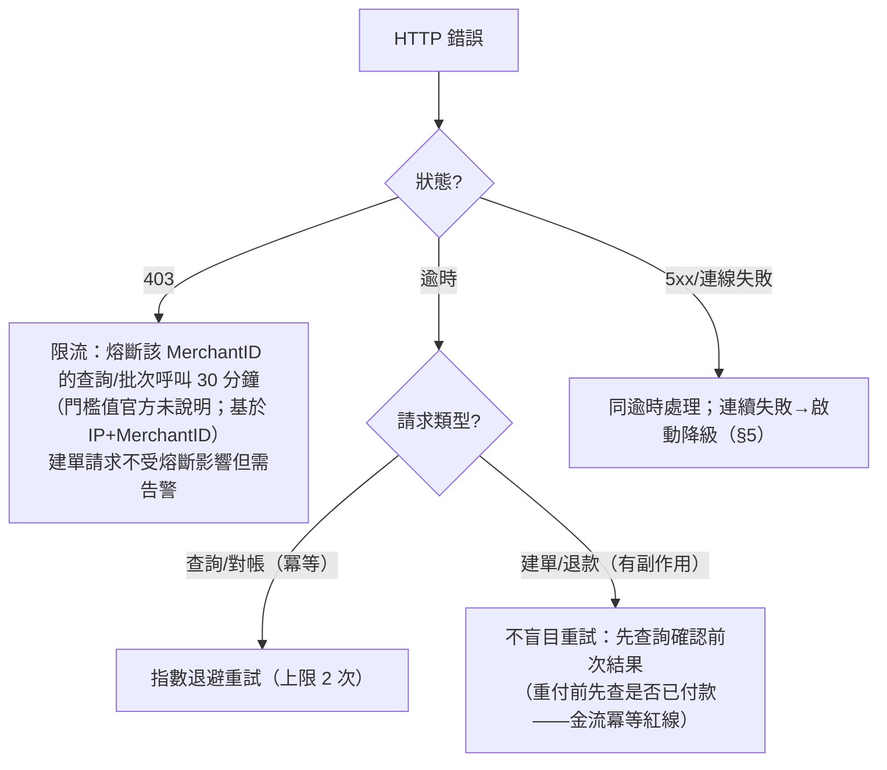

# 04-8. 錯誤處理（Error Handling）

> 定義錯誤的分類法、每一類的處理策略、以及系統級降級方案。原則：**先分類，再決定重試／終止／人工**；把「非錯誤的狀態碼」誤判為錯誤，與把「暫時性錯誤」當永久失敗，是兩大事故來源。

## 1. 錯誤分類法（依協議層次）

### 1.1 語意層（最容易寫出 bug 的一層）

| 陷阱 | 正確理解 |
|------|---------|
| ATM `RtnCode=2`、CVS/BARCODE `RtnCode=10100073` | **取號成功**，不是錯誤；誤判會錯誤取消訂單 |
| RtnCode 型別 | CMV 類（AIO）為字串 `'1'`；AES-JSON 類為整數 `1`——型別比對錯誤會讓**所有成功交易被判為失敗** |
| 同碼跨服務異義 | `10300006`：AIO=超商繳費期限已過、國內物流=物流訂單已過期；`10100058`：AIO=ATM 繳費期限已過、發票=作業逾時。**代碼字典必須以（服務,代碼）為鍵**，不可只以代碼為鍵 |
| BNPL TradeStatus=0 | 「申請受理中」，不是未付款 |
| SimulatePaid=1 | 通知合法、狀態可更新，但不可觸發出貨等副作用 |

## 2. 常見業務錯誤碼與處理策略（AIO 家族）

> 官方明示錯誤代碼持續新增，完整清單需至綠界廠商後台「交易狀態代碼查詢」；下表為官方文件明載的常見碼。

| RtnCode | 含義 | 可重試 | 系統處理 |
|---------|------|:-----:|---------|
| 10200047 | MerchantTradeNo 重複 | 否 | 產生新編號重建——通常代表冪等占位邏輯有洞，需告警 |
| 10200073 | CheckMacValue 驗證失敗 | 否 | 檢查金鑰配對與 encode 實作；**連續出現→疑似金鑰異動/洩漏，升級處理** |
| 10200058 | 信用卡授權失敗 | 消費者側 | 引導換卡重試；不自動重試 |
| 10200043 | 3D 驗證失敗 | 消費者側 | 引導重新驗證 |
| 10200115 | 信用卡授權逾時 | 消費者側 | 引導重新付款；**先查詢確認未成功**再允許重付（防重複扣款） |
| 10200095 | 交易已付款（重複付款） | 否 | 檢查本地狀態是否漏更新 |
| 10200050 | TotalAmount 超出範圍 | 否 | 參數檢核缺陷，修正後重建 |
| 10200009 | 訂單已過期 | 否 | 重新建單 |
| 10100058／10300006 | ATM／超商繳費期限已過 | 否 | 重新建單取號 |
| 10200105 | BNPL 低於最低金額（3,000） | 否 | 前端先擋 |
| 10400011 | WAF 關鍵字攔截 | 否 | ItemName/TradeDesc 含系統指令關鍵字；送出前消毒 |
| 10800001 | 觸動綠界風險控管 | 否 | 人工／客服 |
| 10200141／10200146／5100071 | 服務未開通／不支援分期 | 否 | 帳號設定問題，聯繫綠界 |

## 3. 分層處理策略

### 3.1 HTTP 層

### 3.2 傳輸層（AES-JSON 的 TransCode≠1）

多為工程缺陷而非營運事件：加密實作（padding/Base64 alphabet/urlencode 順序）、JSON 格式、Timestamp 超過 10 分鐘（主機時差）。處理：**不重試**，記錄原文＋告警，人工修正。上線後突然出現→優先懷疑金鑰輪換或主機時間漂移。

### 3.3 業務層（RtnCode≠成功值）

依 §2 表格的「可重試」欄分流：**否**→終態落庫；**消費者側**→回饋 UI 引導；重試一律經佇列與退避，不在請求執行緒內迴圈。

### 3.4 回呼側錯誤

- 驗章失敗：回 4xx、記原文、告警（可能偽造或金鑰異動）；**不回 `1|OK`**。
- 金額不符：回 `1|OK`（停止重送）但凍結訂單＋告警——重送 4 次不會讓金額變對，人工才能裁決。
- Handler 內部例外：必須全捕獲，避免 500 觸發重送風暴；例外時的回應策略＝「已落原文則回 `1|OK`、否則讓它重送」。

## 4. 錯誤觀測（監控門檻）

| 指標 | 正常 | 告警 | 動作 |
|------|------|------|------|
| 交易成功率 | >95% | <90% 持續 30 分鐘 | 暫停新單、檢查帳號/參數 |
| CMV/AES 驗證失敗率 | <1% | >5% | 檢查金鑰是否被輪換/洩漏 |
| 回呼接收率（回呼數/建單數） | ≈1:1 | 差異 >10% 持續 1 小時 | 啟動主動查詢恢復；檢查回呼端點 |
| 回呼處理 P95 | <3 秒 | >8 秒 | 移佇列非同步 |
| HTTP 403 次數 | 0 | ≥1 | 檢討呼叫頻率、熔斷 |

> 門檻為初始參考值，應以自身 2 週穩定期資料校準（促銷期另計）。

## 5. 系統級降級策略

| 故障場景 | 降級 | 恢復條件 |
|---------|------|---------|
| ECPay API 全面不可用 | Feature Flag 暫停收款、顯示維護頁（Flag 用環境變數控制，免部署切換） | ECPay 恢復 |
| 回呼收不到 | 切換為 QueryTradeInfo 輪詢模式（限流預算內） | 回呼恢復 |
| CheckMacValue 連續驗證失敗 | 暫停處理＋聯繫綠界確認金鑰 | 金鑰確認 |
| 發票 API 故障 | 金流不受影響；發票轉人工補開清單 | 發票 API 恢復 |
| 疑似金鑰洩漏 | 金鑰洩漏 SOP（見 `03-architecture/04-security.md` §3） | 新金鑰上線 |

## 6. 錯誤資料的留存

- 所有非成功回應與回呼原文**全文落庫**（含 HTTP 狀態、TransMsg/RtnMsg），保留期限對齊交易憑證（≥180 天）。
- 錯誤碼字典表（服務,代碼→含義,策略）集中於 `shared/codes` 單一出處；官方後台新增代碼時同步更新。
