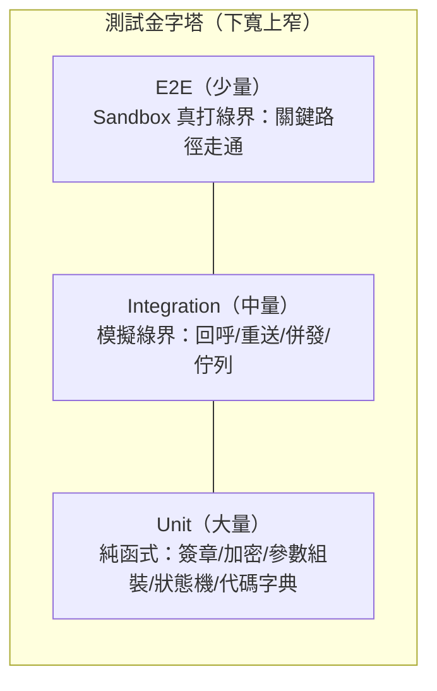

# 05-1. 測試策略總綱與三層測試規劃

> 金流測試的特殊性：①部分關鍵 API **在測試環境不可用**（DoAction、ReAuth、撥款對帳檔）；②對手方（綠界）的行為無法完全控制；③錯誤的代價是真金白銀。策略必須圍繞這三點設計。

## 1. 測試金字塔與範圍分工

| 層 | 測什麼 | 依賴 | 執行頻率 |
|----|--------|------|---------|
| Unit | 演算法與規則的正確性 | 無外部依賴 | 每次 commit |
| Integration | 模組間協作與時序（用假綠界） | 本地 DB／佇列 | 每次 PR |
| E2E | 與真綠界 sandbox 的契約 | 網路＋綠界測試環境 | 每日排程＋release 前（**不進 commit pipeline**，避免限流與外部不穩定拖垮 CI） |
| 人工驗收 | 測試環境測不到的部分（退款、撥款對帳、正式金鑰） | 正式環境小額交易 | 上線時（見 `04-golive-and-regression.md`） |

## 2. Unit Test 規劃

### 2.1 簽章與加密（最高優先）

| 測項 | 說明 |
|------|------|
| CheckMacValue 產生 | 用 **官方測試向量**逐一比對（排序、金鑰包夾、urlencode、.NET 字元還原、小寫、SHA256、大寫，見 `03-architecture/04-security.md` §1） |
| CheckMacValue 邊界 | 含 `~`、空格、`()!*.-_`、中文、`&`/`<` 的參數值；NeedExtraPaidInfo 全欄位納入 |
| CheckMacValue 驗證 | timing-safe；大小寫不符/截斷/空值一律失敗 |
| AES 加解密 | 官方測試向量往返比對；PKCS7；標準 Base64（拒絕 URL-safe）；加密前 urlencode、解密後 urldecode 的順序 |
| 兩套 URL encode 隔離 | `ecpayUrlEncode` 與 `aesUrlEncode` 各自的差異案例；互換必失敗的案例（防呆迴歸） |

### 2.2 參數組裝與檢核

- MerchantTradeNo：長度 ≤20、僅英數、唯一性產生器的碰撞測試。
- MerchantTradeDate／Timestamp：UTC+8 轉換（模擬主機在 UTC 時區）、Unix 秒（非毫秒）。
- ItemName：400 字元截斷（含多位元組字元）先於簽章；HTML 標籤/控制字元/WAF 關鍵字消毒。
- 金額：正整數；拒絕 0、負數、小數、非數字。
- 各付款方式專屬參數：定期定額（PeriodType×Frequency×ExecTimes 值域組合）、BNPL ≥3,000、分期期數白名單。
- 發票規則：統編/捐贈/載具三選一互斥矩陣；ItemAmount 加總＝SalesAmount（含混稅四捨五入）。

### 2.3 狀態機與代碼字典

- 付款狀態機：合法轉移全覆蓋＋非法轉移全拒絕（`03-architecture/03-state-machines.md`）。
- 取號成功碼（`'2'`／`'10100073'`）→ info_issued 而非 failed。
- RtnCode 型別：字串 `'1'`（CMV）與整數 `1`（AES-JSON）分別判定正確。
- 代碼字典以（服務,代碼）為鍵：`10300006` 在 AIO 與物流回傳不同含義。
- 退款決策表：帳務狀態 × 全額/部分 → 正確的 C/R/E/N 序列；非信用卡 PaymentType → 拒絕。

## 3. Integration Test 規劃（假綠界）

以可程式化的「綠界模擬器」（stub HTTP server）替代真實綠界，覆蓋真環境難以製造的時序：

| 場景群 | 測項 |
|--------|------|
| 回呼接收 | 各回呼端點的格式解析（Form vs JSON+AES）、驗章失敗回 4xx、金額不符凍結、`1\|OK` 精確格式與 HTTP 200 |
| 冪等與併發 | 同一通知重送 4 次→狀態轉移一次、副作用一次；**兩個併發重送同時到達**（條件式 UPDATE 只有一邊贏）；ReturnURL 與 OrderResultURL 並發 |
| 二段式付款 | PaymentInfoURL→ReturnURL 順序；只收到其一；逾期無回呼→排程判定 expired |
| 佇列 | 回應 `1\|OK` 在耗時工作之前送出；Worker 失敗重試冪等；死信處理 |
| 查詢補救 | 漏回呼→輪詢補寫 paid（與回呼共用轉移路徑）；403 熔斷 30 分鐘 |
| 對帳 | 對帳檔解析（V1/V2/V3、Big5/UTF8、空檔）、四類比對結果、差異報告產生 |
| 降級 | Feature Flag 切換；綠界全掛時建單請求的行為 |

## 4. E2E Test 規劃（真綠界 sandbox）

> 細節（帳號、卡號、工具）見 `03-sandbox-plan.md`；逐案例清單見 `02-test-cases.md`。

- **關鍵路徑最小集**：信用卡付款成功、ATM 取號＋模擬繳費、回呼驗章通過、查詢一致、對帳媒體檔含該筆交易。
- 執行節奏：每日排程＋release 前；請求間隔節流，**絕不做壓測**（觸發 IP 限流殃及全隊）。
- 斷言以「本地狀態機結果」為準，不逐字比對綠界回應文案（RtnMsg 文字可能變動）。

## 5. 測試環境限制對策略的影響（設計時先認清）

| 測不到的 | 原因 | 替代做法 |
|---------|------|---------|
| DoAction 請退款 | 測試環境無實際授權 | Unit 覆蓋決策表＋Integration 假綠界模擬回應＋上線後正式環境小額實測 |
| 定期定額 ReAuth | 官方明示 stage 不可測 | 同上 |
| 信用卡撥款對帳檔 | 測試環境不可用 | 以自製樣本檔測解析器＋上線後真檔驗證 |
| 3D 完整驗證體驗 | 測試環境固定簡訊碼 1234 | sandbox 走流程；正式環境首筆小額交易驗證 |
| 綠界重送的真實節奏 | 由綠界排程決定 | Integration 用模擬器主動重送 |
