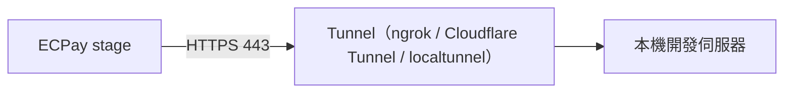

# 05-3. Sandbox 測試規劃

> 綠界測試環境（`-stage` 網域）的使用計畫：帳號、卡號、模擬工具、本機回呼、限制與紀律。

## 1. 官方公開測試帳號（金流相關）

> ⚠️ 公開共用帳號：所有開發者共用，測試交易可能被他人看到；**禁止**用於正式環境、**禁止**把正式金鑰寫進版本控制。

| 用途 | MerchantID | HashKey | HashIV | 協議 |
|------|-----------|---------|--------|------|
| 金流 AIO | 3002607 | pwFHCqoQZGmho4w6 | EkRm7iFT261dpevs | CMV-SHA256 |
| ECPG（站內付 2.0／幕後授權／幕後取號） | 3002607 | pwFHCqoQZGmho4w6 | EkRm7iFT261dpevs | AES-JSON |
| 電子發票 | 2000132 | ejCk326UnaZWKisg | q9jcZX8Ib9LM8wYk | AES-JSON |
| 平台商（AIO／ECPG） | 3002599／3003008 | —（見官方測試介接資訊頁） | — | — |

> 金流與發票帳號**不同**且金鑰配對——同專案串多服務時混用帳號是 CheckMacValue 失敗的常見根因。

## 2. 測試卡號與驗證碼

| 卡別 | 卡號 | 用途 |
|------|------|------|
| VISA（國內） | 4311-9522-2222-2222 | 一般／3D 流程 |
| VISA（國內） | 4311-9511-1111-1111 | 一般 |
| VISA（國際） | 4000-2011-1111-1111 | 國際卡 |
| AMEX | 3403-532780-80900（國內）／3712-222222-22222（國際） | 限閘道商 |
| 永豐 30 期 | 4938-1777-7777-7777 | 分期 |

- 安全碼：任意 3 碼；效期：任意未過期年月；**3D 驗證碼固定 `1234`**（不需真簡訊）。

## 3. 模擬付款能力

| 能力 | 方式 | 注意 |
|------|------|------|
| 信用卡付款 | 測試卡直接走完流程 | 通知為真格式 |
| ATM／超商繳費 | 綠界**廠商後台**（vendor-stage）的模擬付款功能觸發第二段通知 | 通知會帶 `SimulatePaid=1`——驗證系統「更新狀態但不出貨」的行為正是測試重點 |
| 定期定額後續期 | 由綠界排程決定 | 首期即時可測；後續期時機不可控 |

## 4. 本機開發收回呼

回呼僅送 port 80/443 且需公網可達，本機（localhost:3000 等）收不到。方案：

- Tunnel URL 每次變動時，建單參數中的 ReturnURL/PaymentInfoURL 等需同步更新（做成環境變數）。
- 團隊共用 stage 帳號時，以 MerchantTradeNo 前綴區分開發者，避免互相撈到對方交易。

## 5. Sandbox 測試的已知限制（與 `01-test-strategy.md` §5 對應）

| 限制 | 影響 |
|------|------|
| DoAction 不可用（無實際授權） | 退款只能假綠界＋正式環境驗收 |
| 定期定額 ReAuth 不可測 | 同上 |
| 信用卡撥款對帳檔不可用 | 解析器用自製樣本；真檔上線後驗 |
| 發票 NotifyURL 不發通知、不發信 | 通知處理以 Integration 模擬 |
| 測試環境勿帶真實 Email | 個資保護；用測試信箱 |
| 共用環境有他人流量 | 對帳檔會含他人交易？以自己的 MerchantTradeNo 過濾（同 MerchantID 下依編號前綴隔離） |
| IP 層限流與正式相同 | **禁止對 sandbox 壓測**；403 會鎖 30 分鐘、殃及全隊 |

## 6. Sandbox 例行測試排程建議

| 頻率 | 內容 |
|------|------|
| 每日 | E2E 關鍵路徑最小集（信用卡成功、ATM 取號、回呼驗章、查詢一致） |
| 每週 | 對帳媒體檔下載＋解析＋比對全流程 |
| release 前 | `02-test-cases.md` 全部 E 層案例 |
| 官方「更新歷程」頁有異動時 | 受影響 API 的 E 層案例＋更新 `02-api-capability-matrix.md` |
