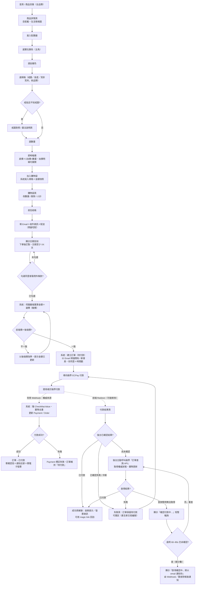
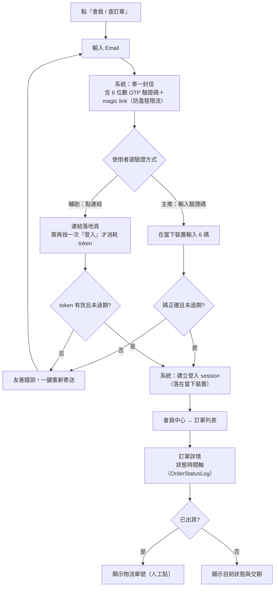
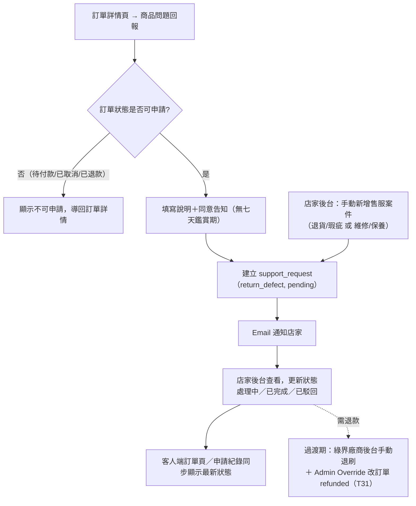
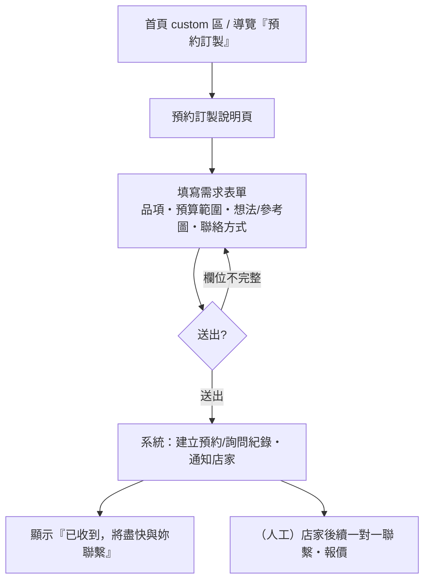

# P03 User Flow — 使用者流程（v2 更新版）

> 任務：P03（M-1 規劃）。依賴 P02 PRD、Brand Guide v2。
> v2 變動：① 全產品線（戒指／耳環／手鍊／項鍊；MVP 戒指起步）② 半客製選配選項依品類不同 ③ 新增「全客製預約」動線。
> 範圍：MVP 動線——**① 首購下單　② 回訪查單　③ 售後申請　④ 全客製預約**。
> 下游：P04 IA（頁面與 URL）、P05 Wireframe（各頁線框）。
> 原則：結帳即會員＋magic link、伺服器端驗價、快照、綠界金流／發票、黑貓宅配、不擋庫存以交期告知、客製例外同意。

---

## 0. 圖例與約定

- **使用者動作 / 系統動作 / 決策點（`{ }`）**。
- `🚫不做`＝Phase 2+（3D 即時預覽、LINE 通知、物流自動追蹤、完整全客製報價鎖價流程）。
- 對應任務以 `T##` 標示。
- **半客製選配選項（依品類；數量為共通）**：
  - **戒指**：寶石顏色／金屬色／戒圍
  - **耳環**：寶石顏色／金屬色／耳針或耳夾
  - **手鍊**：寶石顏色／金屬色／長度
  - **項鍊**：寶石顏色／金屬色／長度

  以下流程以**戒指**為範例，其他品類選項集不同、流程相同。

---

## 1. 流程一：首購下單（訪客 → 會員，端到端）

MVP 主指標「完整閉環」的核心路徑。目標：自助、價格透明、低摩擦（呼應客群主導、反感推銷）。

### 1.1 步驟細節與系統動作

| #   | 使用者動作                                      | 系統動作                                                                                                                        | 對應任務       |
| --- | ----------------------------------------------- | ------------------------------------------------------------------------------------------------------------------------------- | -------------- |
| 1   | 瀏覽商品目錄（全品類）、進詳情頁                | 呈現選配後靜態合成圖＋配戴/生活情境圖                                                                                           | T14、T15、T55  |
| 2   | 配置器選寶石→金屬色→規格→數量                   | 依白名單顯示可選值；選項變動即時換圖；即時計價                                                                                  | T16、T17、T18  |
| 3   | （戒指不確定戒圍）看量法頁                      | 戒圍對照與量法                                                                                                                  | T54            |
| 4   | 加入購物袋                                      | 寫 `unit_price_snapshot`＋`config_snapshot`                                                                                     | T19、T20       |
| 5   | 檢視購物袋、調整                                | 重算小計（仍以快照單價）                                                                                                        | T21            |
| 6   | 結帳填 Email／收件／配送                        | 顯示交期告知（不擋庫存）                                                                                                        | T22            |
| 7   | 勾選同意客製例外                                | 存同意內容＋時間戳                                                                                                              | T57            |
| 8   | —                                               | **伺服器端驗價**（重算金額＋運費）                                                                                              | T41            |
| 9   | —                                               | 建立訂單（待付款）；以 Email 辨識/建立會員                                                                                      | T23            |
| 10  | 進行付款                                        | 建付款請求、導向綠界                                                                                                            | T24、T25       |
| 11  | 抵達付款結果頁                                  | **背景 Webhook 為準**；結果頁若尚未確認，後台**主動呼叫綠界訂單查詢 API**快速對帳（驗章、冪等去重、更新狀態），數秒內回明確結果 | T26、T53、T27  |
| 12  | （已確認）解鎖查單/發票；或（失敗）回失敗頁重試 | 成功→寄確認信＋通知店家＋開電子發票；失敗→保留待付款                                                                            | T30a、T49、T42 |

### 1.2 關鍵決策點與邊界

- **付款判定以背景 Webhook 為準**：綠界以「背景伺服器通知（帶 CheckMacValue）」＋「前端 Redirect 結果頁」兩條回來；成敗一律以**背景通知**為準（使用者可能中途關閉視窗，結果頁那條會遺失，背景通知仍會到）。
- **前端跳轉早於 Webhook（race condition）**：使用者抵達結果頁時後台可能還沒收到 Webhook → 結果頁先顯示「確認付款中…」Loading，以**輪詢（Polling）**（MVP 首選，較 WebSocket 簡單）確認狀態為「已付款」後，才解鎖查單提示與發票資訊——**避免讓使用者看到「待付款」而驚慌**。
- **輪詢逾時 ≠ 失敗（三態＋主動對帳，MVP）**：付款結果有三態——已確認成功／已確認失敗／**尚未確認**。使用者在結果頁等待時，後台**即主動呼叫綠界「訂單查詢 API」取得權威狀態並冪等更新**，讓使用者通常**數秒內**得到明確結果（不必空等 Webhook）——這是高端體驗的關鍵：快速、不讓客戶對系統失去信任。**不可顯示「失敗，請重試」**：未確認屬「處理中」、很可能其實已付款，重試會雙重扣款；只有**綠界明確回報失敗**才進失敗頁、才可重試。極少數（連訂單查詢都暫時取不到）才退到「款項確認中，將以 email 通知你」、不提供重試，由 Webhook／後續重查對帳後通知。
- **失敗／中斷／關閉分頁**：將該次 Payment 標記失敗，**訂單維持「待付款」**，可重試；重試需**產生新的綠界交易編號（MerchantTradeNo 唯一）但掛同一張內部訂單**。
- **重複回拋／重複扣款防護**：冪等去重（T53），狀態只前進一次；**重付前先檢查訂單是否已付款**，防止「首次其實成功但前端顯示失敗 → 再付一次」造成雙重扣款。
- **濫用防護**：對同訂單／同 Email／同 IP 的付款重試做**速率限制＋軟上限**（與 magic link 防濫發 T58 同類機制），避免被當盜刷測試機、拉高拒絕率而連累金流帳號。
- **MVP 政策（已定）**：待付款訂單**不自動取消、不寄未完成提醒**；自動過期與未完成提醒信列 Phase 2。
- **未勾選客製例外同意**：不可送出。
- **前端價≠後端價**：一律以後端重算為準並提示。
- **規格選擇依品類**：戒指走戒圍（不確定 → 量法頁）；耳環走耳針/耳夾；手鍊／項鍊走長度。
- **Email 已是會員**：辨識為既有會員，不另開帳號。
- **庫存**：不擋單，以交期告知管理。
- **配送**：僅黑貓宅配（保價＋本人簽收），台灣宅配費向客人收、國際段內含定價。🚫不做超商。

---

## 2. 流程二：回訪查單（magic link 登入）

| #   | 使用者動作                                             | 系統動作                                                                     | 對應任務      |
| --- | ------------------------------------------------------ | ---------------------------------------------------------------------------- | ------------- |
| 1   | 輸入 Email 要求登入                                    | 寄一封含 **OTP 驗證碼＋magic link** 的信；速率限制                           | T06、T58      |
| 2   | **輸入 6 碼**（主）或**點連結→落地頁按『登入』**（輔） | 驗 OTP/token（高熵、雜湊、單次、短效）、建 session（落在當下裝置）、路由保護 | T07           |
| 3   | 進會員中心                                             | 會員中心框架、個人資料                                                       | T08           |
| 4   | 看訂單狀態與紀錄                                       | 狀態機目前狀態＋變更時間軸                                                   | T28、T29、T32 |
| 5   | （已出貨）看物流                                       | 顯示人工填入的 `tracking_no`                                                 | T31           |

**邊界與設計（已定）：**

- **主推 OTP 驗證碼、magic link 為輔**：驗證碼讓 session 精準落在**當下裝置**（解跨裝置：手機輸入 → 桌機收信也不卡），且 email 安全掃描器「點不掉」一個數字碼。
- **連結落地頁須『再按一次登入』才消耗 token**：防 Outlook SafeLinks／防毒／預覽 bot 先 GET 把單次連結用掉，避免使用者真的去點時看到「已失效」而對系統失去信任。
- **不強制同裝置綁定**：session 落在輸碼／點擊的裝置即可。
- **token 安全**：高熵、雜湊儲存、單次使用、短效（15–60 分）；cookie httpOnly/secure/sameSite；防濫發（T58）。
- **失效/已用過**：友善錯誤＋**一鍵重新寄送**；未登入存取受保護頁 → 導向登入。
- 狀態變更 email 通知（T30b）。🚫LINE、🚫物流自動追蹤、🚫**跨裝置自動接力**（A 輪詢、B 點擊後 A 自動登入）列 Phase 2——有 OTP 後通常不需要。

---

## 3. 流程三：售後申請（T33 已實作，2026-07-02）

法規界線：**半客製品＝法定客製品，無七天鑑賞退貨**（拍板，見 §3.1 A1）。所有退貨走「商品問題回報」→ 店家人工確認 → 手動 trigger 退款（T47）。

客戶端僅開放單一入口「**商品問題回報**」（實質＝退貨/瑕疵申訴，存 `return_defect`）；「維修/保養」（`repair_maintenance`）暫不開放客人自助送出，僅供店家於後台手動登錄 email/電話進來的案件。

| #   | 使用者動作                                       | 系統動作                                                                    | 對應任務 |
| --- | ------------------------------------------------ | --------------------------------------------------------------------------- | -------- |
| 1   | 訂單詳情頁點「商品問題回報」（僅可申請狀態顯示） | 顯示告知區塊＋既有申請紀錄                                                  | T33      |
| 2   | 填寫說明並送出                                   | service role 重驗訂單擁有權與資格 → 建立 `support_request` → email 通知店家 | T33      |
| 3   | —                                                | 店家後台查看／改狀態（處理中／已完成／已駁回）；可手動新增維修/保養案件     | T33      |
| 4   | （店家判斷需退款）                               | 過渡期：綠界廠商後台手動退刷＋ Admin Override 改訂單 `refunded`             | T31      |
| 5   | —                                                | 完整審核分流＋綠界退刷 API 自動化                                           | T47      |

邊界：客製限瑕疵/錯誤可退；不做佐證照片上傳（照片由店家收到通知後 email 往來索取）；不硬擋重複申請（見 §3.1 G19）；對外法律文字律師審（T36、T57）。

### 3.1 待確認討論項目（尚未拍板，先記錄）

> ⚠️＝高風險（法規／會計合規），建議優先鎖 **A、C**；其餘可於 wireframe／開發階段收。

**A. 資格與適用範圍**

1. ✅ **已拍板（2026-07-02）**：半客製品＝法定客製品，**無七天鑑賞退貨**。所有退貨走申請→店家人工確認→手動 trigger 退款（T47）。⚖️ 對外法律用詞仍待律師審定版取代（T36）。
2. 退貨／瑕疵申請時效（到貨後幾天）。
3. 商品狀態要求（未配戴、包裝／附件／證書齊全）。

**B. 申請類型與分流** 4. 🔶 **部分拍板（2026-07-02）**：客人自助端僅開放單一入口「商品問題回報」（`return_defect`），**不含**「尺寸不合改圈／換尺寸」獨立分類；日後是否開放獨立分類待律師確認後再議（DB `request_type` check 已預留擴充彈性）。5. 🔶 **部分拍板（2026-07-02）**：MVP 客人自助僅退款一種出口，不支援換貨選項；換貨機制留待 T47 一併定案。6. 維修保養的保固範圍／期限、保固內外收費（`repair_maintenance` 目前僅供後台手動登錄，尚未定價/保固邏輯）。

**C. 退款機制（金流＋會計合規）** 7. ⚠️ **已開電子發票退款須開折讓單／作廢發票**（財政部規定，必做）。8. 全額 vs 部分退款；運費退不退。9. ⚠️ **客製品已開始／已完成製作的退款比例**（扣訂金／工本）——須寫進條款。10. 綠界刷退時效與限制（當日／跨日、授權後可退期限）。

**D. 退貨物流** 11. 退貨運費負擔（瑕疵＝店家、非瑕疵七天退＝消費者）。12. 退貨方式／地址／保價／簽收；人工收件後幾日內退款。

**E. 狀態機與通知** 13. 售後狀態設計：獨立 RMA 狀態（申請中／審核中／已核准／已退款／已駁回／維修中／已完成）vs 掛訂單。14. 各節點 email 通知內容；會員中心售後進度顯示。15. 審核時限承諾（工作天）。

**F. 法規與條款（律師審）** 16. ⚠️ 七天鑑賞期 wording、**客製品例外**、**民法瑕疵擔保**三者分清（瑕疵擔保與七天解除權是兩回事）。17. 售後說明頁內容大綱（退換條件／流程／運費／時效／保固）。

**G. 異常邊界** 18. 一張訂單多件 → 部分品項退。19. ✅ **已拍板（2026-07-02）**：重複申請不硬擋——T47 狀態機未定案，硬擋等於預做決策；且無照片上傳時再送一筆是客人唯一補充管道。頁面顯示既有申請紀錄＋提示，人工後台處理；防連點靠送出鈕 `disabled` 防呆。超期申請暫無時效限制，留待 T47／律師確認後補。

---

## 4. 流程四：全客製預約（新增）

對應首頁「custom／預約訂製」入口。**MVP 階段只做「預約／詢問表單」**，捕捉需求並通知店家、由人工一對一後續；完整全客製（報價→確認書→鎖價→製作）為 **Phase 3，🚫MVP 不做**。

| #   | 使用者動作                      | 系統動作                         | 備註                 |
| --- | ------------------------------- | -------------------------------- | -------------------- |
| 1   | 從首頁/導覽進預約訂製           | 顯示說明頁＋表單                 | 入口已在 homepage    |
| 2   | 填品項/預算/想法/聯絡方式、送出 | 基本欄位驗證、建立紀錄、通知店家 | 通知沿用 T49 模式    |
| 3   | 看「已收到」確認                | （可選）寄確認信                 | —                    |
| 4   | —                               | 人工後續聯繫                     | 全自動報價 🚫Phase 3 |

邊界：表單為輕量新增（非編號 MVP 任務），可重用既有通知機制；不接金流、不建訂單。

---

## 5. 跨流程：訂單狀態接觸點（對齊狀態機 T28）

狀態：**待付款 → 已付款/處理中 → 製作中 → 已出貨 → 已完成**；分支：**已取消 / 已退款**。
每次變更寫 `OrderStatusLog`（T29），必要狀態 email 通知（T30a/T30b），會員中心可見時間軸（T32）。

---

## 6. MVP 取捨彙整

| 項目            | MVP 做法                                                                                   | Phase 2+                     |
| --------------- | ------------------------------------------------------------------------------------------ | ---------------------------- |
| 品類            | 戒指起步，全品類（耳環/手鍊/項鍊）由後台擴充                                               | —                            |
| 半客製選配      | 依品類選項集（寶石/金屬色/規格/數量）                                                      | —                            |
| 全客製          | **預約/詢問表單**（人工後續）                                                              | 🚫完整報價→確認書→鎖價→製作  |
| 付款重試/待付款 | 保留不取消・可重試（速率限制＋冪等防重複扣款）・不寄提醒                                   | 待付款自動過期、未完成提醒信 |
| 付款確認/對帳   | Webhook 為準＋成功頁等待時**主動呼叫綠界訂單查詢 API**快速對帳；email-pending 為最後安全網 | —（主動對帳已納入 MVP）      |
| 商品呈現        | 靜態疊圖＋配戴/生活情境圖                                                                  | 🚫3D 即時預覽                |
| 會員登入        | Email **OTP 驗證碼（主）＋magic link（輔，落地頁 confirm 再消耗）**・不綁同裝置            | 跨裝置自動接力               |
| 通知            | Email                                                                                      | 🚫LINE                       |
| 物流            | 黑貓宅配・單號人工貼                                                                       | 🚫自動追蹤、🚫超商           |
| 售後物流        | 人工收件                                                                                   | 自動化                       |

---

## 7. 待澄清（餵 P04 IA / P05 Wireframe）

1. **首頁角色**：品牌故事＋主打款 landing，或直接導向商品目錄？（已在 homepage 採前者）
2. **配置器入口**：**於商品詳情頁內展開**（非獨立配置頁）。已定——後續 URL 結構與 T16 線框依此設計。
3. **品類規格差異**：已定（見 §0）。戒指＝戒圍；耳環＝耳針/耳夾；手鍊・項鍊＝長度。
4. **情境圖位置與數量**：詳情頁／配置器如何穿插配戴情境圖，促成「這就是我」。
5. **預約訂製表單欄位**：品項、預算帶、想法、參考圖上傳、聯絡方式——欄位最小集需定。
6. **會員中心範圍**：MVP 是否含收件人/偏好管理。
7. **售後入口**：已定——**僅從訂單發起**，另設**售後說明頁**（說明七天鑑賞/瑕疵/維修保養與流程）。

---

## 8. 下一步

P03（v2）完成。接 **P04 IA**（網站地圖／導覽／URL，含全品類分類與 custom 入口）→ **P05 Wireframe**（首頁／商品目錄／詳情頁／**配置器**／購物袋／結帳／會員中心／預約訂製表單）。Wireframe 完成後再進 M0/M1 開發。
